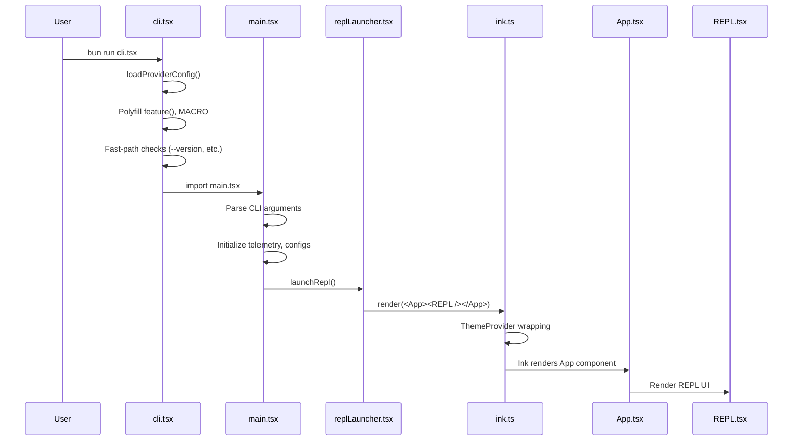

# 第 2 章：入口与启动流程

Gong Code 的启动流程涉及多个关键文件的协作。本章深入分析从 `cli.tsx` 到 REPL 渲染的完整链路，解释 Polyfill 系统的设计原理。

## 2.1 启动流程总览

```
cli.tsx → main.tsx → replLauncher.tsx → ink.ts → REPL 渲染
```



> **图 2.1: 启动流程时序图** — 来源：[src/entrypoints/cli.tsx:1](https://github.com/gongzhen/2026/claude-code/blob/main/src/entrypoints/cli.tsx)

## 2.2 cli.tsx — 真正的入口点

`src/entrypoints/cli.tsx` 是 Gong Code 的真正入口文件。由于 Bun 运行时在模块加载方面的特性，这个文件必须在最早期完成几项关键任务。

### 2.2.1 Provider 配置加载

在所有其他导入之前，必须先加载 Provider 配置。这是因为 ES 模块的导入提升（import hoisting）机制，任何模块在初始化时都可能检查环境变量。

```typescript
// src/entrypoints/cli.tsx (Lines 12-64)
function loadProviderConfig(): void {
    const configDir = process.env.GONG_CONFIG_DIR ?? process.env.CLAUDE_CONFIG_DIR ?? join(homedir(), '.gong');
    const configPath = join(configDir, 'providers.json');
    
    try {
        if (existsSync(configPath)) {
            const content = readFileSync(configPath, 'utf-8');
            const config = JSON.parse(content);
            const defaultProvider = config.defaultProvider || 'minimax';
            
            // 设置默认 Provider
            if (!process.env.MODEL_PROVIDER) {
                process.env.MODEL_PROVIDER = defaultProvider;
            }
            
            // 根据 Provider 设置对应的 API Key
            if (providerConfig?.apiKey) {
                if (provider === 'minimax') {
                    process.env.MINIMAX_API_KEY = providerConfig.apiKey;
                    process.env.ANTHROPIC_API_KEY = providerConfig.apiKey;
                } else if (provider === 'glm') {
                    process.env.GLM_API_KEY = providerConfig.apiKey;
                } else if (provider === 'openai') {
                    process.env.OPENAI_API_KEY = providerConfig.apiKey;
                }
            }
            
            // 设置模型
            if (providerConfig?.model) {
                // ...
            }
        }
    } catch {
        // Config 不存在时使用默认值
    }
    
    if (!process.env.MODEL_PROVIDER) {
        process.env.MODEL_PROVIDER = 'minimax';
    }
}
```

配置加载的优先级：
1. 环境变量 `GONG_CONFIG_DIR` 或 `CLAUDE_CONFIG_DIR`
2. 默认 `~/.gong/providers.json`

### 2.2.2 Polyfill 系统 — 为什么要 Polyfill

Gong Code 使用 `feature()` 函数作为特性开关，这个函数在构建时由 Bun 的 `bun:bundle` 替换为常量表达式，实现 dead code elimination (DCE)。

但是，在运行时（非构建时），`feature()` 需要有一个实现。Gong Code 的策略是**始终返回 `false`**：

```typescript
// src/entrypoints/cli.tsx (Lines 79-95)

// Runtime polyfill for bun:bundle (build-time macros)
const feature = (_name: string) => false;
```

**为什么这样做？**

1. **构建时 vs 运行时**：Gong Code 从源代码反编译后运行，反编译产物中 `feature('XXX')` 调用保留了源代码的形式，但 `bun:bundle` 宏不存在

2. **始终返回 false 的含义**：所有被 `feature('FLAG_NAME')` 包裹的代码在运行时都是**死代码**。这意味着 COORDINATOR_MODE, KAIROS, PROACTIVE 等实验性功能都不可用

3. **安全的设计**：即使有人尝试在配置中启用这些功能，代码也不会执行，因为 `feature()` 永远返回 `false`

**MACRO 全局变量注入**：

```typescript
if (typeof globalThis.MACRO === "undefined") {
    (globalThis as any).MACRO = {
        VERSION: "0.1.6",
        BUILD_TIME: new Date().toISOString(),
        FEEDBACK_CHANNEL: "",
        ISSUES_EXPLAINER: "",
        NATIVE_PACKAGE_URL: "",
        PACKAGE_URL: "",
        VERSION_CHANGELOG: "",
    };
}

// Build-time constants
(globalThis as any).BUILD_TARGET = "external";
(globalThis as any).BUILD_ENV = "production";
(globalThis as any).INTERFACE_TYPE = "stdio";
```

这些值在构建时由 Bun 注入到产物中。运行时 polyfill 确保即使反编译产物中引用了这些全局变量，程序也能正常运行。

### 2.2.3 快速路径 (Fast-path)

`cli.tsx` 实现了多个快速路径，避免加载完整的 CLI 模块：

```typescript
// src/entrypoints/cli.tsx (Lines 140-393)
async function main(): Promise<void> {
    const args = process.argv.slice(2);

    // Fast-path 1: --version (零模块加载)
    if (args.length === 1 && (args[0] === "--version" || args[0] === "-v")) {
        console.log(`${MACRO.VERSION} (Gong Code)`);
        return;
    }

    // Fast-path 2: --dump-system-prompt (需要配置加载)
    if (feature("DUMP_SYSTEM_PROMPT") && args[0] === "--dump-system-prompt") {
        const { getSystemPrompt } = await import("../constants/prompts.js");
        const prompt = await getSystemPrompt([], model);
        console.log(prompt.join("\n"));
        return;
    }

    // Fast-path 3: Chrome MCP 相关
    if (process.argv[2] === "--claude-in-chrome-mcp") {
        const { runClaudeInChromeMcpServer } = await import("../utils/claudeInChrome/mcpServer.js");
        await runClaudeInChromeMcpServer();
        return;
    }

    // ... 更多快速路径: --daemon-worker, remote-control, daemon, ps|logs|attach|kill 等

    // 默认路径: 加载完整 CLI
    const { main: cliMain } = await import("../main.jsx");
    await cliMain();
}
```

**快速路径的设计原则**：
- 最小化模块评估
- 零依赖或最小依赖
- 提前返回，避免执行不相关的逻辑

## 2.3 main.tsx — Commander.js CLI 定义

`src/main.tsx` 是使用 Commander.js 定义的 CLI 界面。这个文件非常庞大（2000+ 行），包含完整的参数解析和启动模式选择。

### 2.3.1 模块级初始化

main.tsx 在模块加载时执行多项初始化：

```typescript
// src/main.tsx (Lines 1-20)
import { profileCheckpoint, profileReport } from './utils/startupProfiler.js';
profileCheckpoint('main_tsx_entry');

import { startMdmRawRead } from './utils/settings/mdm/rawRead.js';
startMdmRawRead();  // 并行启动 MDM 子进程

import { startKeychainPrefetch } from './utils/secureStorage/keychainPrefetch.js';
startKeychainPrefetch();  // 并行读取 macOS keychain
```

这些初始化利用并行执行减少启动时间。

### 2.3.2 CLI 参数解析

Commander.js 定义了所有 CLI 命令和选项：

```typescript
// main.tsx 中的 Commander 定义（简化示例）
const program = new Command();

program
    .name('gong')
    .description('Gong Code - Terminal AI Programming Assistant')
    .version(MACRO.VERSION);

program
    .command('daemon')
    .description('Start daemon mode')
    .action(() => daemonMain());

program
    .command('ps')
    .description('List running sessions')
    .action(() => bg.psHandler());

// 默认启动 REPL 模式
program.action(() => launchRepl());
```

### 2.3.3 启动模式选择

main.tsx 支持多种启动模式：

| 模式 | 命令 | 描述 |
|------|------|------|
| REPL | `gong` | 交互式终端模式（默认） |
| Daemon | `gong daemon` | 后台守护进程模式 |
| Remote | `gong remote-control` | 远程控制模式 |
| Background | `gong --bg` | 后台会话模式 |

## 2.4 REPL 启动流程

REPL 启动涉及多个文件的协作：

```
main.tsx → launchRepl() → replLauncher.tsx → ink.ts → render()
```

### 2.4.1 launchRepl 函数

`main.tsx` 调用 `launchRepl()` 启动 REPL：

```typescript
// src/main.tsx（简化）
import { launchRepl } from './replLauncher.js';
import type { Root } from './ink.js';

async function launchRepl(root: Root, appProps, replProps, renderAndRun) {
    const { App } = await import('./components/App.js');
    const { REPL } = await import('./screens/REPL.js');
    
    await renderAndRun(root, 
        <App {...appProps}>
            <REPL {...replProps} />
        </App>
    );
}
```

### 2.4.2 replLauncher.tsx

`src/replLauncher.tsx` 是 REPL 启动的封装：

```typescript
// src/replLauncher.tsx
export async function launchRepl(
    root: Root,
    appProps: AppWrapperProps,
    replProps: REPLProps,
    renderAndRun: (root: Root, element: React.ReactNode) => Promise<void>
): Promise<void> {
    const { App } = await import('./components/App.js');
    const { REPL } = await import('./screens/REPL.js');
    
    await renderAndRun(root, (
        <App {...appProps}>
            <REPL {...replProps} />
        </App>
    ));
}
```

## 2.5 Ink 渲染原理

Ink 是 React 的终端渲染引擎，允许使用 React 组件构建 CLI 界面。

### 2.5.1 ThemeProvider 包装

`src/ink.ts` 是 Ink 渲染的封装层：

```typescript
// src/ink.ts
import { createElement, type ReactNode } from 'react';
import { ThemeProvider } from './components/design-system/ThemeProvider.js';

function withTheme(node: ReactNode): ReactNode {
    return createElement(ThemeProvider, null, node);
}

export async function render(
    node: ReactNode,
    options?: NodeJS.WriteStream | RenderOptions,
): Promise<Instance> {
    return inkRender(withTheme(node), options);
}

export async function createRoot(options?: RenderOptions): Promise<Root> {
    const root = await inkCreateRoot(options);
    return {
        ...root,
        render: node => root.render(withTheme(node)),
    };
}
```

**设计意图**：
- 所有通过 Ink 渲染的组件都自动被 `ThemeProvider` 包装
- `ThemedBox` 和 `ThemedText` 等主题组件可以直接使用，无需每个调用点都手动包装
- Ink 本身是主题无关的，通过 ThemeProvider 提供主题上下文

### 2.5.2 Ink 组件层次

```
Root (createRoot)
└── ThemeProvider
    └── App
        └── REPL
            ├── Messages
            ├── PromptInput
            └── StatusBar
```

## 2.6 关键文件职责表

| 文件 | 路径 | 职责 |
|------|------|------|
| cli.tsx | `src/entrypoints/cli.tsx` | Polyfill 系统、Provider 配置加载、快速路径处理 |
| main.tsx | `src/main.tsx` | Commander.js CLI 定义、参数解析、启动模式选择 |
| replLauncher.tsx | `src/replLauncher.tsx` | REPL 组件包装、动态导入 App 和 REPL |
| ink.ts | `src/ink.ts` | Ink 渲染封装、ThemeProvider 包装、颜色/组件导出 |
| REPL.tsx | `src/screens/REPL.tsx` | 主 REPL 界面（258KB，包含完整交互逻辑） |

## 2.7 Polyfill 系统的设计意义

Polyfill 系统是 Gong Code 架构中的关键设计，理解它有助于理解整个项目：

### 为什么需要 Polyfill？

1. **反编译产物的特殊性**：Gong Code 的运行时代码来自反编译，保留了原始代码的形式但丢失了构建时的宏展开

2. **构建时优化与运行时的矛盾**：原始代码使用 `feature()` 实现条件编译（编译时决定哪些代码包含在产物中），但运行时需要这些函数有具体实现

3. **安全且简洁的方案**：让 `feature()` 始终返回 `false`：
   - 简单可靠，不需要复杂的运行时检测
   - 保证了实验性功能不会意外启用
   - 所有 `feature()` 后的代码都被正确地排除

### MACRO 全局变量的作用

`globalThis.MACRO` 注入了构建时常量：

| 属性 | 用途 |
|------|------|
| VERSION | 版本号显示 |
| BUILD_TIME | 构建时间戳 |
| FEEDBACK_CHANNEL | 反馈渠道 |
| ISSUES_EXPLAINER | 问题解释器 URL |

这些值在用户执行 `--version` 等命令时直接引用。

## 2.8 总结

本章分析了 Gong Code 的入口和启动流程：

1. **cli.tsx** 作为真正入口，在所有其他模块加载前完成：
   - Provider 配置加载（利用 ES 模块导入提升之前的时机）
   - Polyfill 系统初始化（feature() 和 MACRO）
   - 快速路径处理（--version 等）

2. **main.tsx** 定义了完整的 CLI 界面，使用 Commander.js 处理参数解析和启动模式选择

3. **replLauncher.tsx** 和 **ink.ts** 协作完成 REPL 的渲染：
   - 动态导入减少初始加载时间
   - ThemeProvider 自动包装所有组件

4. **Polyfill 系统**是理解 Gong Code 架构的关键 — 它解释了为什么 `feature()` 始终返回 `false` 以及这带来的设计含义

下一章我们将深入分析 Provider 层，了解多模型支持的具体实现。

> **交叉引用**: 启动流程与查询循环的协作详见 [第 4 章：查询循环与错误恢复](./4-query-loop.md)；状态初始化详见 [第 8 章：状态管理](./8-state.md)。
