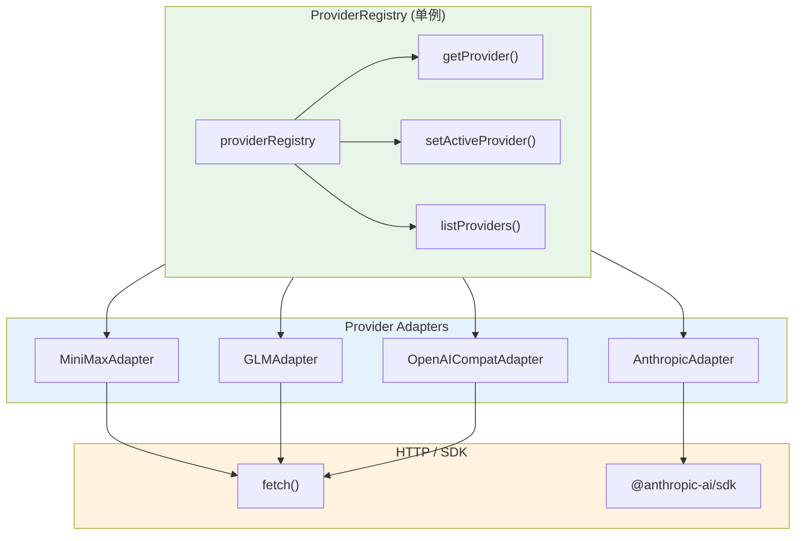
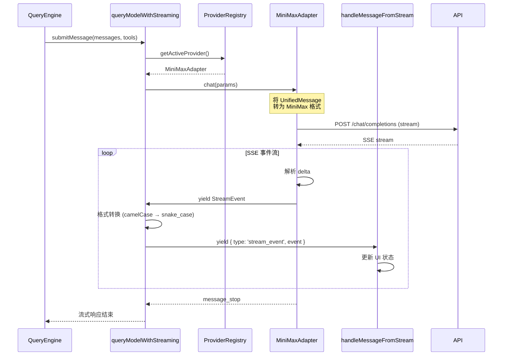

# 第 3 章：API Multi-Provider 架构

Gong Code 的 API 层采用适配器（Adapter）模式，通过统一的 Provider 接口支持多种大模型。本章深入分析 Provider 架构的设计原理、事件流转机制以及格式转换逻辑。

## 3.1 Provider 架构总览



> **图 3.1: Provider 架构总览** — 来源：[src/services/api/providers/registry.ts:1](https://github.com/gongzhen/2026/claude-code/blob/main/src/services/api/providers/registry.ts)

**架构特点**：

1. **ProviderRegistry** 是全局单例，负责管理所有 Provider 的注册和获取
2. 每个 Provider 是独立的适配器，实现统一的 `ModelProvider` 接口
3. 适配器内部处理具体协议的差异，对外暴露统一格式
4. 流式事件格式统一为 `StreamEvent`，上层无需关心底层差异

## 3.2 ProviderRegistry 单例

`src/services/api/providers/registry.ts` 实现了 Provider 注册中心。

### 核心方法

```typescript
// src/services/api/providers/registry.ts

class ProviderRegistry {
  private static instance: ProviderRegistry
  private providers = new Map<string, ModelProvider>()
  private factories = new Map<string, ProviderFactory>()
  private activeProviderName: string = 'minimax'

  static getInstance(): ProviderRegistry { ... }

  /** 注册 Provider 实例 */
  register(provider: ModelProvider): void {
    this.providers.set(provider.name, provider)
  }

  /** 注册 Provider 工厂函数 */
  registerFactory(name: string, factory: ProviderFactory): void {
    this.factories.set(name, factory)
  }

  /** 获取 Provider 实例 */
  get(name?: string, config?: ProviderConfig): ModelProvider {
    const providerName = name || this.activeProviderName
    const existing = this.providers.get(providerName)
    if (existing && !config) return existing

    const factory = this.factories.get(providerName)
    if (factory) {
      const provider = factory(config)
      if (!config) this.providers.set(providerName, provider)
      return provider
    }

    // 回退到 minimax
    return this.providers.get('minimax')!
  }

  /** 设置当前激活的 Provider */
  setActiveProvider(name: string): void { ... }

  /** 获取当前激活的 Provider */
  getActiveProvider(): ModelProvider {
    return this.get(this.activeProviderName)
  }
}

export const providerRegistry = ProviderRegistry.getInstance()
```

### 便捷函数

```typescript
// 导出便捷函数，减少调用层级的样板代码
export function getProvider(name?: string, config?: ProviderConfig): ModelProvider {
  return providerRegistry.get(name, config)
}

export function getActiveProvider(): ModelProvider {
  return providerRegistry.getActiveProvider()
}

export function setActiveProvider(name: string): void {
  providerRegistry.setActiveProvider(name)
}
```

### Provider 查找顺序

1. 已在 `providers` Map 中的实例，直接返回
2. 通过 `factories` Map 创建新实例并缓存（若未传入 config）
3. 回退到默认 `minimax` Provider

## 3.3 Provider 接口定义

```typescript
// src/services/api/providers/types.ts

export interface ModelProvider {
  /** Provider 名称 */
  readonly name: string

  /** 显示名称 */
  readonly displayName: string

  /** 能力声明 */
  readonly capabilities: ProviderCapabilities

  /**
   * 流式 Chat 请求
   * @returns 流式事件生成器
   */
  chat(params: ChatParams): AsyncGenerator<StreamEvent, void, unknown>

  /**
   * 非流式 Chat 请求
   */
  chatSync(params: ChatParams): Promise<ChatResponse>

  /** 验证 API Key */
  validateApiKey?(apiKey: string): Promise<boolean>

  /** 获取可用模型列表 */
  listModels?(): Promise<string[]>
}
```

### 能力声明

```typescript
// src/services/api/providers/types.ts

export interface ProviderCapabilities {
  /** 是否支持流式响应 */
  streaming: boolean
  /** 是否支持工具调用 */
  toolUse: boolean
  /** 是否支持视觉/图片输入 */
  vision: boolean
  /** 是否支持扩展思考 */
  thinking: boolean
  /** 是否支持系统提示词 */
  systemPrompt: boolean
  /** 最大上下文长度 */
  maxContextLength?: number
  /** 最大输出 token 数 */
  maxOutputTokens?: number
}
```

### Chat 参数

```typescript
export interface ChatParams {
  messages: UnifiedMessage[]
  systemPrompt?: UnifiedSystemPrompt
  tools?: UnifiedTool[]
  model?: string
  maxTokens?: number
  temperature?: number
  topP?: number
  stopSequences?: string[]
  thinking?: ThinkingConfig
  signal?: AbortSignal
}
```

## 3.4 统一消息格式

Provider 接口使用与具体 SDK 无关的 `UnifiedMessage` 和 `UnifiedContent` 类型：

```typescript
// 统一消息
export interface UnifiedMessage {
  role: 'user' | 'assistant' | 'system'
  content: string | UnifiedContent[]
}

// 统一内容块
export type UnifiedContent =
  | UnifiedTextContent       // { type: 'text', text: string }
  | UnifiedImageContent      // { type: 'image', source: { type: 'url'|'base64', url?, data?, mediaType? } }
  | UnifiedToolUseContent    // { type: 'tool_use', id, name, input }
  | UnifiedToolResultContent // { type: 'tool_result', toolUseId, content, isError? }
  | UnifiedThinkingContent   // { type: 'thinking', thinking: string }
```

## 3.5 支持的 Provider

### MiniMaxAdapter（默认）

MiniMax 是 Gong Code 的默认 Provider，支持 1M 上下文。

```typescript
// src/services/api/providers/MiniMaxAdapter.ts

export class MiniMaxAdapter extends BaseAdapter {
  readonly name = 'minimax'
  readonly displayName = 'MiniMax'

  get capabilities(): ProviderCapabilities {
    const isVisionModel = normalizedModel.includes('abab') ||
                          normalizedModel.includes('text-01')
    return {
      streaming: true,
      toolUse: true,
      vision: isVisionModel,
      thinking: !isVisionModel,  // M2.7 支持 Interleaved Thinking
      systemPrompt: true,
      maxContextLength: 1_000_000,
      maxOutputTokens: 16_384,
    }
  }
}
```

**特点**：
- 使用 OpenAI 兼容的 `/chat/completions` 接口
- M2.7 系列支持 Interleaved Thinking（`thinking` 参数）
- 多模态模型（abab、text-01）支持 Vision

### GLMAdapter

```typescript
// src/services/api/providers/GLMAdapter.ts
export class GLMAdapter extends BaseAdapter {
  readonly name = 'glm'
  readonly displayName = 'GLM'
  // ...
}
```

**特点**：
- 使用 OpenAI 兼容协议
- 支持智谱 AI 的 GLM 系列模型

### OpenAICompatAdapter

```typescript
// src/services/api/providers/OpenAICompatAdapter.ts
export class OpenAICompatAdapter extends BaseAdapter {
  readonly name = 'openai-compat'
  readonly displayName = 'OpenAI Compatible'
  // ...
}
```

**特点**：
- 通用 OpenAI 兼容接口适配器
- 支持任意兼容 OpenAI API 格式的模型
- 可配置 `baseUrl` 指向不同端点

### AnthropicAdapter

```typescript
// src/services/api/providers/AnthropicAdapter.ts
export class AnthropicAdapter extends BaseAdapter {
  readonly name = 'anthropic'
  readonly displayName = 'Anthropic'
  // ...
}
```

**特点**：
- 直接使用 `@anthropic-ai/sdk` 官方 SDK
- 支持完整的 Anthropic API 特性

## 3.6 流式事件类型

```typescript
// src/services/api/providers/types.ts

export type StreamEventType =
  | 'message_start'         // 消息开始
  | 'content_block_start'  // 内容块开始
  | 'content_block_delta'  // 内容块增量
  | 'content_block_stop'   // 内容块结束
  | 'message_delta'        // 消息尾部（含 usage）
  | 'message_stop'         // 消息结束
  | 'error'                // 错误

export interface StreamEvent {
  type: StreamEventType
  index?: number
  contentBlock?: Partial<UnifiedContent>
  delta?: {
    type: string
    text?: string
    partialJson?: string
    thinking?: string
  }
  message?: Partial<ChatResponse>
  usage?: Partial<TokenUsage>
  error?: { type: string; message: string }
}
```

### 事件序列

一个完整的流式响应事件序列：

```
message_start
  └─ content_block_start (index: 0, type: 'text')
  │     └─ content_block_delta (index: 0, delta: { type: 'text_delta', text: '你好' })
  │     └─ content_block_delta (index: 0, delta: { type: 'text_delta', text: '，' })
  │     └─ content_block_delta (index: 0, delta: { type: 'text_delta', text: '世界' })
  │     └─ content_block_stop (index: 0)
  └─ content_block_start (index: 1, type: 'tool_use')
  │     └─ content_block_delta (index: 1, delta: { type: 'input_json_delta', partial_json: '{"url"' })
  │     └─ content_block_delta (index: 1, delta: { type: 'input_json_delta', partial_json: ':"https' })
  │     └─ content_block_stop (index: 1)
  └─ message_delta (usage: { outputTokens: 50 })
  └─ message_stop
```

## 3.7 事件格式转换 — Provider 到 UI

Provider 返回的 `StreamEvent` 使用 camelCase 格式（`contentBlock`, `inputTokens`），但 UI 层的 `handleMessageFromStream` 期望 Anthropic SDK 格式（snake_case：`content_block`, `input_tokens`）。

这个转换在 `src/services/api/claude.ts` 的 `queryModelWithStreaming()` 函数中完成：

```typescript
// src/services/api/claude.ts (Lines 1100-1186)

for await (const event of provider.chat(chatParams)) {
  const anthropicEvent: Record<string, unknown> = { type: event.type }

  switch (event.type) {
    case 'message_start':
      anthropicEvent.message = {
        id: messageId,
        type: 'message',
        role: 'assistant',
        content: [],
        model,
        stop_reason: null,
        stop_sequence: null,
        usage: {
          input_tokens: event.message?.usage?.inputTokens || 0,  // camelCase → snake_case
          output_tokens: 0,
        },
      }
      break

    case 'content_block_start':
      anthropicEvent.index = event.index
      // contentBlock → content_block
      if (event.contentBlock?.type === 'tool_use') {
        anthropicEvent.content_block = {
          type: 'tool_use',
          id: event.contentBlock.id || '',
          name: event.contentBlock.name || '',
          input: event.contentBlock.input || {},
        }
      } else {
        anthropicEvent.content_block = {
          type: event.contentBlock?.type || 'text',
          text: event.contentBlock?.text || '',
        }
      }
      break

    case 'content_block_delta':
      anthropicEvent.index = event.index
      if (event.delta?.type === 'text_delta') {
        anthropicEvent.delta = { type: 'text_delta', text: event.delta.text || '' }
      } else if (event.delta?.type === 'thinking_delta') {
        anthropicEvent.delta = { type: 'thinking_delta', thinking: event.delta.thinking || '' }
      } else if (event.delta?.partialJson !== undefined) {
        anthropicEvent.delta = { type: 'input_json_delta', partial_json: event.delta.partialJson }
      }
      break

    case 'message_delta':
      anthropicEvent.delta = { stop_reason: 'end_turn', stop_sequence: null }
      anthropicEvent.usage = { output_tokens: event.usage?.outputTokens || 0 }
      break
  }

  yield { type: 'stream_event', event: anthropicEvent }
}
```

### 转换对照表

| Provider Event (camelCase) | UI Event (snake_case) |
|---------------------------|----------------------|
| `contentBlock` | `content_block` |
| `inputTokens` | `input_tokens` |
| `outputTokens` | `output_tokens` |
| `partialJson` | `partial_json` |
| `stopReason` | `stop_reason` |
| `stopSequence` | `stop_sequence` |

## 3.8 API 调用时序图



> **图 3.2: API 调用时序图** — 来源：[src/services/api/claude.ts:1100](https://github.com/gongzhen/2026/claude-code/blob/main/src/services/api/claude.ts)

## 3.9 适配器实现模式

每个适配器继承 `BaseAdapter`，实现两个核心方法：

```typescript
// src/services/api/providers/BaseAdapter.ts

export abstract class BaseAdapter implements ModelProvider {
  abstract readonly name: string
  abstract readonly displayName: string
  abstract readonly capabilities: ProviderCapabilities

  abstract chat(params: ChatParams): AsyncGenerator<StreamEvent, void, unknown>
  abstract chatSync(params: ChatParams): Promise<ChatResponse>

  // 通用辅助方法
  protected extractTextContent(content: string | UnifiedContent[]): string
  protected extractToolUses(content: UnifiedContent[]): UnifiedToolUseContent[]
  protected extractToolResults(content: UnifiedContent[]): UnifiedToolResultContent[]
  protected systemPromptToString(systemPrompt?: string | string[]): string
  protected wrapError(error: unknown, defaultMessage: string): ProviderError
}
```

**适配器实现要点**：

1. **消息转换**：将 `UnifiedMessage[]` 转为 Provider 特定格式
2. **工具转换**：将 `UnifiedTool[]` 转为 Provider 工具格式
3. **事件映射**：将 Provider 的 SSE 事件转为 `StreamEvent`
4. **错误包装**：将 Provider 错误统一包装为 `ProviderError`

### MiniMax 消息转换示例

```typescript
// src/services/api/providers/MiniMaxAdapter.ts

private toMiniMaxMessages(messages: UnifiedMessage[]): MiniMaxMessage[] {
  const result: MiniMaxMessage[] = []

  // 添加系统提示词
  if (sysPrompt) {
    result.push({ role: 'system', content: sysPrompt })
  }

  for (const msg of messages) {
    if (msg.role === 'user') {
      // 处理图片内容
      if (hasImage) {
        contentArray.push({
          type: 'image_url',
          image_url: { url: imageUrl }
        })
      }
      result.push({ role: 'user', content: contentArray })
    } else if (msg.role === 'assistant') {
      if (toolUses.length > 0) {
        result.push({
          role: 'assistant',
          content: text || undefined,
          tool_calls: toolUses.map(tu => ({
            id: tu.id,
            type: 'function',
            function: { name: tu.name, arguments: JSON.stringify(tu.input) }
          }))
        })
      }
    }
  }
  return result
}
```

## 3.10 错误处理

所有 Provider 错误统一包装为 `ProviderError`：

```typescript
// src/services/api/providers/types.ts

export class ProviderError extends Error {
  constructor(
    message: string,
    public readonly type: ProviderErrorType,
    public readonly statusCode?: number,
    public readonly providerName?: string,
    public readonly cause?: Error
  ) {
    super(message)
    this.name = 'ProviderError'
  }
}

export type ProviderErrorType =
  | 'authentication_error'  // 401/403
  | 'rate_limit_error'       // 429
  | 'invalid_request_error'  // 400
  | 'api_error'              // 5xx
  | 'connection_error'      // 网络错误
  | 'timeout_error'          // 超时
  | 'unknown_error'
```

## 3.11 总结

本章分析了 Gong Code 的多 Provider 架构：

1. **ProviderRegistry 单例** 提供了全局的 Provider 管理机制，支持通过名称获取或切换 Provider

2. **ModelProvider 接口** 定义了统一的抽象，对上层隐藏了不同模型的协议差异

3. **适配器模式** 使得新增 Provider 变得简单，只需继承 `BaseAdapter` 并实现 `chat()` 和 `chatSync()` 方法

4. **事件格式转换** 是架构中的关键层：Provider 返回 camelCase 格式的 `StreamEvent`，在 `queryModelWithStreaming()` 中被转换为 UI 期望的 snake_case Anthropic SDK 格式

5. **流式事件体系** 支持 text、tool_use、thinking 等多种内容块类型，通过增量（delta）事件实现实时流式输出

下一章我们将分析查询循环（Query Loop），了解消息如何被处理、工具如何被调用、以及状态如何在多次交互中累积。

> **交叉引用**: Provider 架构是查询循环的基础，详见 [第 4 章：查询循环与错误恢复](./4-query-loop.md)；Provider 与状态管理的交互详见 [第 8 章：状态管理](./8-state.md)。
