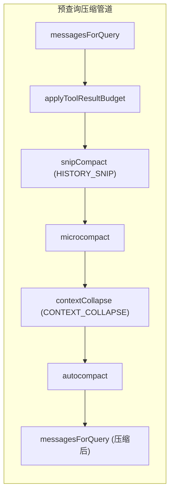
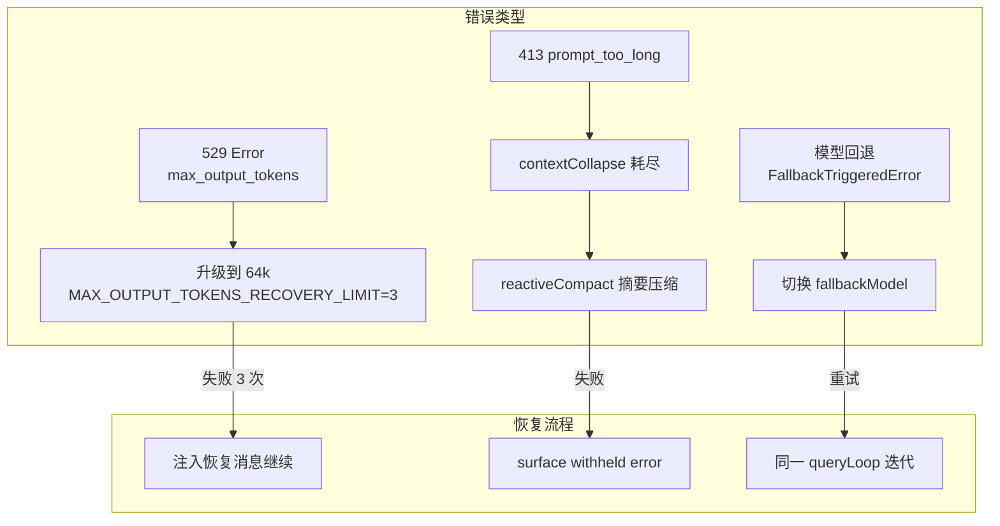
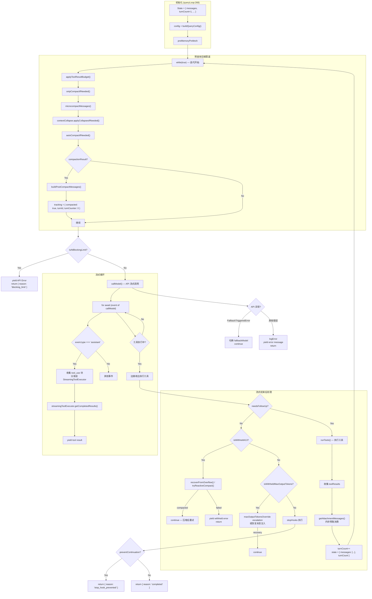

# 第 4 章：Agent Core — 查询循环与错误恢复

查询循环（Query Loop）是 Gong Code Agent 的核心引擎，负责管理多轮对话状态、执行工具调用、处理上下文压缩，以及从各种 API 错误中自动恢复。本章深入分析状态机定义、预查询压缩管道、API 流式调用以及错误恢复机制。

## 4.1 QueryEngine 与 Query 的职责划分

`QueryEngine`（`src/QueryEngine.ts`）和 `query()`（`src/query.ts`）承担不同层次的职责：

| 维度 | QueryEngine | query() |
|------|------------|---------|
| **作用域** | 会话级别 — 跨多次 submitMessage 调用持久化状态 | 单次查询级别 — 一次 API 请求及其工具循环 |
| **状态管理** | `mutableMessages`、`totalUsage`、`readFileState`、`permissionDenials` | `State` 类型中的 `messages`、`turnCount`、`autoCompactTracking` |
| **生命周期** | 整个对话会话 | 每次 `query()` 调用（一次用户输入可能触发多次递归） |
| **核心职责** | 1. 处理用户输入（processUserInput）<br>2. 管理会话消息历史<br>3. 追踪 Token 使用量和成本<br>4. 处理 SDK 消息标准化 | 1. 构建系统提示词<br>2. 执行预查询压缩管道<br>3. 调用 API 流式接口<br>4. 管理工具调用循环<br>5. 处理错误恢复 |
| **调用关系** | QueryEngine 调用 query() | query() 被 QueryEngine 调用 |
| **持久化** | 消息写入 `mutableMessages` 和 transcript | 压缩结果通过 yield 传递回 QueryEngine |

```typescript
// QueryEngine — 会话级编排（src/QueryEngine.ts:211）
async *submitMessage(prompt, options): AsyncGenerator<SDKMessage> {
  // 1. 处理用户输入（/slash 命令、权限等）
  const { messages: messagesFromUserInput } = await processUserInput({...})

  // 2. 更新会话消息历史
  this.mutableMessages.push(...messagesFromUserInput)

  // 3. 调用 query() 执行核心逻辑
  for await (const message of query({ messages, ... })) {
    // 4. 处理流式事件，更新 mutableMessages
    this.mutableMessages.push(message)
    yield message
  }
}

// query — 单次查询的核心循环（src/query.ts:219）
async function* queryLoop(params): AsyncGenerator<StreamEvent | Message> {
  while (true) {
    // 预查询压缩管道
    // API 调用（可能多次递归）
    // 工具执行
    // 错误恢复
  }
}
```

## 4.2 状态机定义

`src/query.ts` 第 204-217 行定义了查询循环的跨迭代状态：

```typescript
// src/query.ts:204-217
type State = {
  messages: Message[]                                    // 当前对话消息数组
  toolUseContext: ToolUseContext                          // 工具调用上下文
  autoCompactTracking: AutoCompactTrackingState | undefined  // 自动压缩状态
  maxOutputTokensRecoveryCount: number                    // max_output_tokens 恢复次数
  hasAttemptedReactiveCompact: boolean                    // 是否已尝试响应式压缩
  maxOutputTokensOverride: number | undefined            // 输出 Token 上限覆盖值
  pendingToolUseSummary: Promise<ToolUseSummaryMessage | null> | undefined  // 工具摘要
  stopHookActive: boolean | undefined                    // 停止钩子是否激活
  turnCount: number                                       // 当前轮次计数
  transition: Continue | undefined                        // 上一次迭代的继续原因
}
```

### AutoCompactTrackingState 结构

```typescript
// src/services/compact/autoCompact.ts:51-60
export type AutoCompactTrackingState = {
  compacted: boolean                                      // 当前迭代是否发生了压缩
  turnCounter: number                                      // 自上次压缩后的轮次计数
  turnId: string                                          // 每次压缩的唯一 ID
  consecutiveFailures?: number                            // 连续压缩失败次数（熔断器）
}
```

### transition 继续原因枚举

`transition` 字段记录上一次迭代为何继续（用于测试断言和日志）：

```typescript
// src/query/transitions.ts
type Continue =
  | { reason: 'next_turn' }                              // 正常下一轮
  | { reason: 'max_output_tokens_escalate' }             // max_output_tokens 升级
  | { reason: 'max_output_tokens_recovery', attempt: number }  // 输出截断恢复
  | { reason: 'collapse_drain_retry', committed: number }    // 上下文折叠耗尽后重试
  | { reason: 'reactive_compact_retry' }                 // 响应式压缩后重试
  | { reason: 'stop_hook_blocking' }                     // 停止钩子阻塞
  | { reason: 'token_budget_continuation' }              // Token 预算继续
```

## 4.3 预查询压缩管道

每次查询迭代都会执行压缩管道，多层协作以保持上下文在模型限制内：



> **图 4.1: 预查询压缩管道** — 来源：[src/query.ts:219](https://github.com/gongzhen/2026/claude-code/blob/main/src/query.ts)

### 4.3.1 applyToolResultBudget — 工具结果预算

**文件**: `src/utils/toolResultStorage.ts:924`

对工具结果内容执行大小限制，防止单个工具结果消耗过多上下文：

```typescript
// 对每个 tool_result 块检查 maxResultSizeChars
// 超过限制的工具结果被替换为占位符
messagesForQuery = await applyToolResultBudget(
  messagesForQuery,
  toolUseContext.contentReplacementState,
  persistReplacements ? records => recordContentReplacement(...) : undefined,
  new Set(unlimitedTools)  // 没有 maxResultSizeChars 限制的工具
)
```

### 4.3.2 microcompact — 每轮轻量截断

**文件**: `src/services/compact/microCompact.ts:253`

微压缩是每轮执行的轻量级清理，不产生摘要消息，直接修改工具结果内容：

```typescript
export async function microcompactMessages(
  messages: Message[],
  toolUseContext?: ToolUseContext,
  querySource?: QuerySource,
): Promise<MicrocompactResult>
```

**两种触发模式**:

1. **时间触发微压缩** — 当距上次 Assistant 消息超过阈值（默认 30 分钟），将旧工具结果替换为 `[Old tool result content cleared]`，通知服务端缓存失效
2. **缓存编辑微压缩**（实验性）— 使用 `cache_edits` API 删除工具结果，保留服务端缓存前缀

```typescript
// 时间触发检查
const trigger = evaluateTimeBasedTrigger(messages, querySource)
if (trigger) {
  const keepRecent = Math.max(1, config.keepRecent)
  const keepSet = new Set(compactableIds.slice(-keepRecent))
  const clearSet = new Set(compactableIds.filter(id => !keepSet.has(id)))
  // 将 clearSet 中的 tool_result 替换为 TIME_BASED_MC_CLEARED_MESSAGE
}
```

### 4.3.3 contextCollapse — 上下文折叠

**文件**: `src/services/contextCollapse/index.js`（实验性）

上下文折叠是一种增量归档机制，当上下文接近阈值时将消息归档到摘要中：

```typescript
if (feature('CONTEXT_COLLAPSE') && contextCollapse) {
  const collapseResult = await contextCollapse.applyCollapsesIfNeeded(
    messagesForQuery,
    toolUseContext,
    querySource,
  )
  messagesForQuery = collapseResult.messages
}
```

**关键行为**:
- 归档消息不直接从数组删除，而是记录到 commit log
- `projectView()` 在每次查询时重放 commit log，还原完整上下文
- 在 90% 阈值触发 commit，95% 触发阻塞式 spawn

### 4.3.4 autocompact — 自动摘要

**文件**: `src/services/compact/autoCompact.ts:241`

自动摘要是在 13k Token 阈值触发的完整压缩，产生摘要消息替换被压缩的对话历史：

```typescript
export async function autoCompactIfNeeded(
  messages: Message[],
  toolUseContext: ToolUseContext,
  cacheSafeParams: CacheSafeParams,
  querySource?: QuerySource,
  tracking?: AutoCompactTrackingState,
  snipTokensFreed?: number,
): Promise<{
  wasCompacted: boolean
  compactionResult?: CompactionResult
  consecutiveFailures?: number
}>
```

**阈值计算**:

```typescript
// src/services/compact/autoCompact.ts:72-91
export function getAutoCompactThreshold(model: string): number {
  const effectiveContextWindow = getEffectiveContextWindowSize(model)
  return effectiveContextWindow - AUTOCOMPACT_BUFFER_TOKENS  // 13,000
}

// AUTOCOMPACT_BUFFER_TOKENS = 13_000
// WARNING_THRESHOLD_BUFFER_TOKENS = 20_000
// ERROR_THRESHOLD_BUFFER_TOKENS = 20_000
```

**熔断器**: 连续 3 次压缩失败后，停止重试避免空转：

```typescript
if (
  tracking?.consecutiveFailures !== undefined &&
  tracking.consecutiveFailures >= MAX_CONSECUTIVE_AUTOCOMPACT_FAILURES  // 3
) {
  return { wasCompacted: false }
}
```

## 4.4 API 流式调用

查询循环的核心是 API 调用层，使用 `deps.callModel()` 封装 Provider 的 `chat()` 方法：

```typescript
// src/query.ts:659-866
for await (const message of deps.callModel({
  messages: prependUserContext(messagesForQuery, userContext),
  systemPrompt: fullSystemPrompt,
  thinkingConfig: toolUseContext.options.thinkingConfig,
  tools: toolUseContext.options.tools,
  signal: toolUseContext.abortController.signal,
  options: {
    model: currentModel,
    fallbackModel,
    maxOutputTokensOverride,
    querySource,
    // ...
  },
})) {
  // 处理流式事件
  if (message.type === 'assistant') {
    assistantMessages.push(assistantMessage)
    // 收集 tool_use 块
    // 分发给 streamingToolExecutor
  }

  // 流式工具执行：边接收 tool_use 边执行工具
  for (const result of streamingToolExecutor.getCompletedResults()) {
    yield result.message
    toolResults.push(...normalizeMessagesForAPI([result.message], ...))
  }

  // 暂存可恢复错误（不在此处 yield）
  let withheld = false
  if (contextCollapse?.isWithheldPromptTooLong(message)) withheld = true
  if (reactiveCompact?.isWithheldPromptTooLong(message)) withheld = true
  if (isWithheldMaxOutputTokens(message)) withheld = true

  if (!withheld) {
    yield message
  }
}
```

### 工具流式执行

`StreamingToolExecutor` 允许在 API 还在流式输出 `tool_use` 块时就开始执行工具：

```typescript
// src/query.ts:561-568
const useStreamingToolExecution = config.gates.streamingToolExecution
let streamingToolExecutor = useStreamingToolExecution
  ? new StreamingToolExecutor(
      toolUseContext.options.tools,
      canUseTool,
      toolUseContext,
    )
  : null

// 在流式循环中实时添加 tool_use 块
for (const toolBlock of msgToolUseBlocks) {
  streamingToolExecutor.addTool(toolBlock, assistantMessage)
}
```

## 4.5 错误恢复机制

查询循环实现了多层错误恢复机制，按优先级依次尝试：



> **图 4.2: 错误恢复机制** — 来源：[src/query.ts:896](https://github.com/gongzhen/2026/claude-code/blob/main/src/query.ts)

### 4.5.1 529 max_output_tokens 错误

当模型输出达到 `max_tokens` 限制时，API 返回 529 错误（或在流式响应中标记为 `max_output_tokens`）：

```typescript
// src/query.ts:175-179
function isWithheldMaxOutputTokens(
  msg: Message | StreamEvent | undefined,
): msg is AssistantMessage {
  return msg?.type === 'assistant' && msg.apiError === 'max_output_tokens'
}

// 恢复策略（src/query.ts:1191-1255）
if (isWithheldMaxOutputTokens(lastMessage)) {
  // 策略 1: 如果使用了默认的 8k 上限，升级到 64k
  if (capEnabled && maxOutputTokensOverride === undefined) {
    return {
      ...state,
      maxOutputTokensOverride: ESCALATED_MAX_TOKENS,  // 64k
      transition: { reason: 'max_output_tokens_escalate' }
    }
  }

  // 策略 2: 注入恢复消息，最多尝试 3 次
  if (maxOutputTokensRecoveryCount < MAX_OUTPUT_TOKENS_RECOVERY_LIMIT) {
    const recoveryMessage = createUserMessage({
      content: `Output token limit hit. Resume directly — no apology, no recap. ` +
              `Pick up mid-thought if that is where the cut happened. ` +
              `Break remaining work into smaller pieces.`,
      isMeta: true,
    })
    return {
      messages: [...messagesForQuery, ...assistantMessages, recoveryMessage],
      maxOutputTokensRecoveryCount: maxOutputTokensRecoveryCount + 1,
      transition: { reason: 'max_output_tokens_recovery', attempt: ... }
    }
  }
}
```

### 4.5.2 413 prompt_too_long 处理

当上下文超过模型限制时，API 返回 413 `prompt_too_long`。恢复流程：

```typescript
// src/query.ts:1088-1186
const isWithheld413 =
  lastMessage?.type === 'assistant' &&
  lastMessage.isApiErrorMessage &&
  isPromptTooLongMessage(lastMessage)

if (isWithheld413) {
  // 策略 1: 尝试耗尽 staged context collapse（如果启用）
  if (
    feature('CONTEXT_COLLAPSE') &&
    state.transition?.reason !== 'collapse_drain_retry'
  ) {
    const drained = contextCollapse.recoverFromOverflow(messagesForQuery, querySource)
    if (drained.committed > 0) {
      return {
        messages: drained.messages,
        transition: { reason: 'collapse_drain_retry', committed: drained.committed }
      }
    }
  }

  // 策略 2: 尝试 reactive compact
  if (reactiveCompact) {
    const compacted = await reactiveCompact.tryReactiveCompact({
      hasAttempted: hasAttemptedReactiveCompact,
      messages: messagesForQuery,
      ...
    })
    if (compacted) {
      // 使用压缩后的消息重试
      return { messages: postCompactMessages, hasAttemptedReactiveCompact: true }
    }
  }

  // 所有恢复失败：surface withheld error
  yield lastMessage
  return { reason: 'prompt_too_long' }
}
```

### 4.5.3 模型回退（FallbackTriggeredError）

当高负载导致主模型不可用时，`FallbackTriggeredError` 触发模型切换：

```typescript
// src/query.ts:896-954
catch (innerError) {
  if (innerError instanceof FallbackTriggeredError && fallbackModel) {
    currentModel = fallbackModel
    attemptWithFallback = true

    // 清除上一轮消息，使用 fallback model 重试
    yield* yieldMissingToolResultBlocks(assistantMessages, 'Model fallback triggered')
    assistantMessages.length = 0
    toolUseBlocks.length = 0

    // 切换模型
    toolUseContext.options.mainLoopModel = fallbackModel

    // 通知用户
    yield createSystemMessage(
      `Switched to ${renderModelName(innerError.fallbackModel)} due to high demand for ${renderModelName(innerError.originalModel)}`,
      'warning',
    )

    continue  // 重试整个 queryLoop
  }
}
```

## 4.6 查询循环完整流程图



> **图 4.3: 查询循环完整流程图** — 来源：[src/query.ts:268](https://github.com/gongzhen/2026/claude-code/blob/main/src/query.ts)

### 关键继续（continue）路径

| 继续原因 | 触发条件 | 状态变更 |
|---------|---------|---------|
| `next_turn` | 正常工具调用循环 | `messages += assistantMessages + toolResults; turnCount++` |
| `max_output_tokens_escalate` | 529 错误 + 未升级过 | `maxOutputTokensOverride = ESCALATED_MAX_TOKENS` |
| `max_output_tokens_recovery` | 3 次升级仍截断 | `messages += recoveryMessage; maxOutputTokensRecoveryCount++` |
| `collapse_drain_retry` | 413 + staged collapse 可耗尽 | `messages = drained.messages` |
| `reactive_compact_retry` | 413 + reactive compact 可用 | `messages = postCompactMessages; hasAttemptedReactiveCompact = true` |
| `stop_hook_blocking` | 停止钩子返回阻塞错误 | `messages += blockingErrors; stopHookActive = true` |
| `token_budget_continuation` | Token 预算允许继续 | `messages += nudgeMessage` |

## 4.7 总结

本章分析了 Gong Code 查询循环的核心机制：

1. **职责分离**: `QueryEngine` 管理会话级状态，`query()` 管理单次查询的迭代状态和压缩管道

2. **预查询压缩管道**: 多层协作 — `applyToolResultBudget` 裁剪超大工具结果、`microcompact` 处理过期工具结果、`contextCollapse` 增量归档、`autocompact` 完整摘要

3. **流式执行**: `StreamingToolExecutor` 允许在 API 流式输出 `tool_use` 时就开始执行工具，减少等待时间

4. **错误恢复**: 三层恢复机制 — 529 错误通过升级输出限制和注入恢复消息恢复、413 错误通过上下文折叠和响应式压缩恢复、模型不可用时自动切换 fallback model

5. **状态机设计**: `State` 类型携带所有跨迭代状态，`transition` 字段记录恢复路径，用于测试断言和调试

下一章我们将分析会话管理（Session），了解消息历史如何在多次查询间持久化、以及 `/compact` 和 `/clear` 等命令如何与查询循环交互。

> **交叉引用**: 压缩管道的详细实现见 [第 5 章：会话管理与多级压缩](./5-session.md)；`StreamingToolExecutor` 的并发控制机制见 [第 6 章：工具执行与权限系统](./6-tool-execution.md)。
