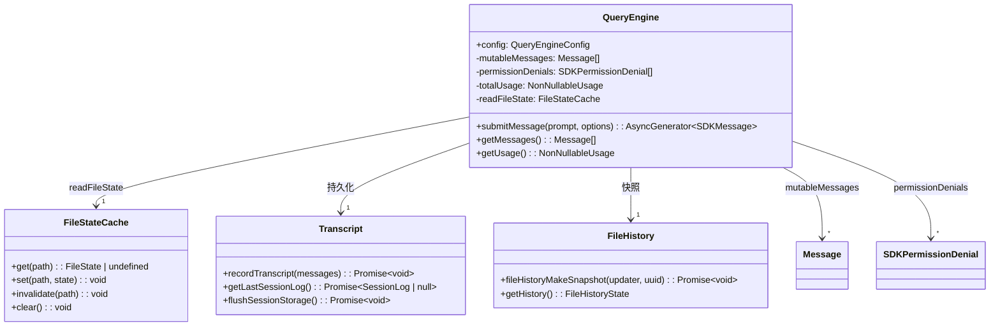
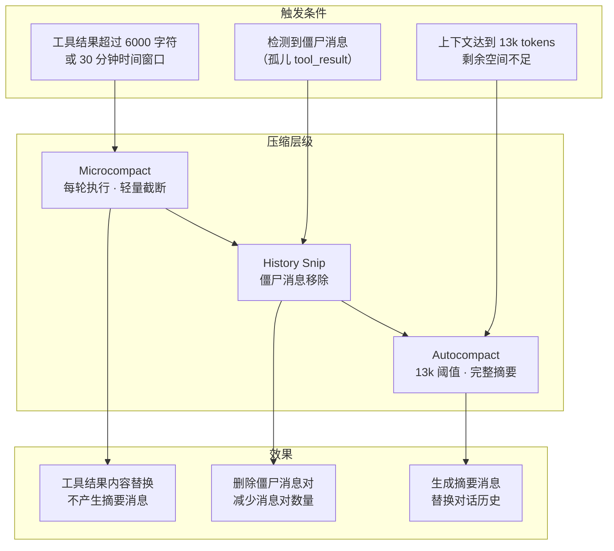
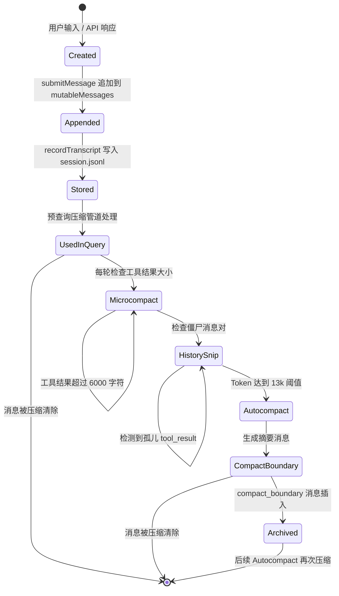
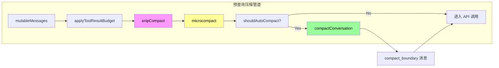

# 第 5 章：Agent Core — 会话管理与多级压缩

会话管理是 Gong Code Agent 持久化对话状态的核心机制。在多次 `submitMessage` 调用之间，消息历史、文件访问缓存、用量统计、权限记录等状态必须完整保留。同时，为了在长会话中保持上下文在模型的上下文窗口限制内，系统实现了多级压缩机制，在不同触发条件下逐步收紧上下文。本章分析 QueryEngine 的状态管理、Transcript 持久化、File History 快照，以及 Microcompact、Autocompact、History Snip 三级压缩的协作方式。

## 5.1 QueryEngine 状态管理

`QueryEngine`（`src/QueryEngine.ts:186`）是会话级状态管理器，每个对话对应一个实例。以下五个核心字段构成了会话的持久化状态：

```typescript
// src/QueryEngine.ts:186-200
export class QueryEngine {
  private config: QueryEngineConfig
  private mutableMessages: Message[]              // 对话消息历史，可动态追加
  private abortController: AbortController         // 可中止的请求控制器
  private permissionDenials: SDKPermissionDenial[] // 权限拒绝记录
  private totalUsage: NonNullableUsage              // Token 用量累计
  private hasHandledOrphanedPermission = false     // 是否已处理孤儿权限请求
  private readFileState: FileStateCache            // 文件状态缓存
  private discoveredSkillNames = new Set<string>() // 本轮发现的技能名称
  private loadedNestedMemoryPaths = new Set<string>() // 已加载的嵌套记忆路径
```

### 5.1.1 mutableMessages — 可变消息队列

`mutableMessages` 是整个对话历史的中央存储，类型为 `Message[]`。每次 `submitMessage` 调用时，新的用户消息和助手消息都会被追加到此数组：

```typescript
// src/QueryEngine.ts:211-232
async *submitMessage(prompt, options): AsyncGenerator<SDKMessage> {
  // 1. 处理用户输入，构建消息
  const { messages: messagesFromUserInput } = await processUserInput({...})

  // 2. 追加到会话消息历史
  this.mutableMessages.push(...messagesFromUserInput)

  // 3. 调用 query() 执行核心逻辑，流式处理响应
  for await (const message of query({ messages, ... })) {
    // 4. 将每次 yielded 消息追加到历史
    this.mutableMessages.push(message)
    yield message
  }
}
```

消息类型包括 `user`（用户输入）、`assistant`（模型回复）、`system`（系统消息，包括 `compact_boundary`）、`tool_result`（工具执行结果）等。

### 5.1.2 permissionDenials — 权限拒绝记录

当工具调用因权限不足被拒绝时，记录被追加到 `permissionDenials` 数组。这些记录用于：

- 在后续交互中提示用户已拒绝的权限
- 避免重复向用户请求同一权限
- 支持 SDK 模式的权限回调

```typescript
// 权限拒绝记录的典型结构
type SDKPermissionDenial = {
  tool: string           // 被拒绝的工具名称
  reason: string          // 拒绝原因
  timestamp: number       // 拒绝时间戳
}
```

### 5.1.3 totalUsage — 用量追踪

`totalUsage` 累计整个会话的 Token 消耗，包括输入 Token、输出 Token、缓存 Token 等维度：

```typescript
// 用量结构
type NonNullableUsage = {
  input_tokens: number
  output_tokens: number
  cache_creation_input_tokens?: number
  cache_read_input_tokens?: number
  // ...
}
```

在每次 `submitMessage` 完成后，API 返回的 `usage` 信息被合并到 `totalUsage` 中，供会话结束时的成本报告使用。

### 5.1.4 readFileState — 文件状态缓存

`readFileState` 是 `FileStateCache` 类型，缓存了文件读取的元信息（路径、内容哈希、最后修改时间等），用于：

- 快速判断文件是否发生变化，避免重复读取
- 跨工具调用共享文件状态
- 在压缩时安全地清理过期的文件引用

```typescript
// src/QueryEngine.ts:203-208
constructor(config: QueryEngineConfig) {
  this.config = config
  this.mutableMessages = config.initialMessages ?? []
  this.abortController = config.abortController ?? createAbortController()
  this.permissionDenials = []
  this.readFileState = config.readFileCache  // 由调用方注入
  this.totalUsage = EMPTY_USAGE
}
```

## 5.2 会话状态管理图



> **图 5.1: 会话状态管理图** — 来源：[src/QueryEngine.ts:186](https://github.com/gongzhen/2026/claude-code/blob/main/src/QueryEngine.ts)

## 5.3 Transcript 持久化

每次 `submitMessage` 完成后，消息历史会被写入持久化存储（`session.jsonl`），以支持 `--resume` 恢复功能：

```typescript
// src/QueryEngine.ts:453-466
if (persistSession && messagesFromUserInput.length > 0) {
  const transcriptPromise = recordTranscript(messages)
  if (isBareMode()) {
    // 脚本模式：非阻塞写入
    void transcriptPromise
  } else {
    // REPL 模式：阻塞写入，确保 resume 可用
    await transcriptPromise
    if (
      isEnvTruthy(process.env.CLAUDE_CODE_EAGER_FLUSH) ||
      isEnvTruthy(process.env.CLAUDE_CODE_IS_COWORK)
    ) {
      await flushSessionStorage()
    }
  }
}
```

**写入时机**：在 API 响应第一个流式消息之后、流式循环完成之前写入。这确保了即使进程在 API 响应过程中被杀死（用户点击 Stop）， transcript 中仍保留用户消息，resume 可以从该点恢复。

**Bare 模式**：脚本/SDK 模式使用 `void transcriptPromise` 非阻塞写入（约 4ms SSD，30ms 磁盘争用），不对性能产生显著影响，但仍然写入以支持事后调试。

## 5.4 File History 快照

File History（文件历史）记录了会话中每个被操作文件的快照，用于：

- 支持 `/undo` 等命令回退文件变更
- 在压缩后重建文件状态一致性
- 提供项目级文件操作历史视图

```typescript
// src/QueryEngine.ts:645-659
if (fileHistoryEnabled() && persistSession) {
  messagesFromUserInput
    .filter(messageSelector().selectableUserMessagesFilter)
    .forEach(message => {
      void fileHistoryMakeSnapshot(
        (updater: (prev: FileHistoryState) => FileHistoryState) => {
          setAppState(prev => ({
            ...prev,
            fileHistory: updater(prev.fileHistory),
          }))
        },
        message.uuid,
      )
    })
}
```

`fileHistoryMakeSnapshot` 为每条用户消息创建快照，通过 `setAppState` 更新 Zustand store 中的 `fileHistory` 状态。快照按消息 `uuid` 索引，压缩后可通过 `uuid` 查找对应的文件状态。

## 5.5 多级压缩机制

Gong Code 实现了三级压缩，在不同触发条件下逐步收紧上下文，平衡了上下文保持和 Token 消耗：



> **图 5.2: 多级压缩机制** — 来源：[src/services/compact/autoCompact.ts:1](https://github.com/gongzhen/2026/claude-code/blob/main/src/services/compact/autoCompact.ts)

### 5.5.1 Microcompact — 每轮轻量截断

**文件**: `src/services/compact/microCompact.ts`

Microcompact 是每轮必执行的轻量级清理，目标是将工具结果内容控制在合理范围内，不产生摘要消息，不改变对话结构。

**核心限制**: `MICROCOMPACT_TOOL_RESULT_LIMIT = 6000` 字符（单个工具结果的文本内容）

**执行时机**: 在预查询压缩管道中执行（见第 4 章 4.3.2），早于 Autocompact。

**两种触发模式**:

**1. 时间触发微压缩**

当距上次 Assistant 消息超过阈值（默认 30 分钟）时，将旧工具结果替换为占位符：

```typescript
// src/services/compact/microCompact.ts:422-444
export function evaluateTimeBasedTrigger(
  messages: Message[],
  querySource: QuerySource | undefined,
): { gapMinutes: number; config: TimeBasedMCConfig } | null {
  const config = getTimeBasedMCConfig()
  if (!config.enabled || !querySource || !isMainThreadSource(querySource)) {
    return null
  }
  const lastAssistant = messages.findLast(m => m.type === 'assistant')
  if (!lastAssistant) return null
  const gapMinutes =
    (Date.now() - new Date(lastAssistant.timestamp as string | number).getTime()) / 60_000
  if (!Number.isFinite(gapMinutes) || gapMinutes < config.gapThresholdMinutes) {
    return null
  }
  return { gapMinutes, config }
}
```

清理行为：将超过时间窗口的旧工具结果内容替换为 `[Old tool result content cleared]`（`TIME_BASED_MC_CLEARED_MESSAGE`），保留工具调用的结构但不消耗上下文空间。由于直接修改了 prompt 内容，服务端缓存会失效，因此同时调用 `notifyCacheDeletion()` 通知缓存断连检测。

**2. 缓存编辑微压缩（实验性）**

对于支持 `cache_edits` API 的模型，使用缓存编辑机制删除工具结果，保留服务端缓存前缀：

```typescript
// src/services/compact/microCompact.ts:305-399
async function cachedMicrocompactPath(
  messages: Message[],
  querySource: QuerySource | undefined,
): Promise<MicrocompactResult> {
  const mod = await getCachedMCModule()
  const state = ensureCachedMCState()
  const compactableToolIds = new Set(collectCompactableToolIds(messages))

  // 注册工具结果
  for (const message of messages) {
    if (message.type === 'user' && Array.isArray(message.message.content)) {
      for (const block of message.message.content) {
        if (block.type === 'tool_result' && compactableToolIds.has(block.tool_use_id)) {
          mod.registerToolResult(state, block.tool_use_id)
        }
      }
    }
  }

  const toolsToDelete = mod.getToolResultsToDelete(state)
  if (toolsToDelete.length > 0) {
    // 创建 cache_edits 块，API 层会在请求中注入
    pendingCacheEdits = mod.createCacheEditsBlock(state, toolsToDelete)
    return { messages, compactionInfo: { pendingCacheEdits: { trigger: 'auto', deletedToolIds: toolsToDelete, ... } } }
  }
  return { messages }
}
```

关键区别：缓存编辑路径**不修改本地消息内容**，而是在 API 请求层添加 `cache_edits` 块，指示服务端从缓存前缀中删除指定工具结果。这避免了重写缓存导致的缓存失效。

**清理范围**: 仅处理 `COMPACTABLE_TOOLS` 集合中的工具，包括 `FileReadTool`、`BashTool`（所有 shell）、`GrepTool`、`GlobTool`、`WebSearchTool`、`WebFetchTool`、`FileEditTool`、`FileWriteTool`。`AgentTool` 等其他工具不被微压缩。

### 5.5.2 History Snip — 移除僵尸消息

**文件**: `src/services/compact/snipCompact.ts`

History Snip 检测并移除「僵尸消息对」—— 即存在 tool_result 但对应的 tool_use 已丢失或无效的消息对。僵尸消息对会虚假地消耗上下文空间，因为模型会看到无法解析的工具调用引用。

**判断逻辑**：

```typescript
// src/services/compact/snipCompact.ts:6
export const isSnipMarkerMessage: (message: Message) => boolean = () => false
// stub — 实际实现在反编译产物中
```

**执行签名**:

```typescript
// src/services/compact/snipCompact.ts:7-14
export const snipCompactIfNeeded: (
  messages: Message[],
  options?: { force?: boolean },
) => { messages: Message[]; executed: boolean; tokensFreed: number; boundaryMessage?: Message } = (messages) => ({
  messages,
  executed: false,
  tokensFreed: 0,
})
// stub — 实际实现在反编译产物中
```

**返回值**:

| 字段 | 含义 |
|------|------|
| `messages` | 压缩后的消息数组 |
| `executed` | 是否实际执行了清理 |
| `tokensFreed` | 释放的 Token 数量估计 |
| `boundaryMessage` | 可选的边界消息（用于追踪） |

**触发方式**:

- **自动触发**: 在预查询压缩管道中（`snipCompactIfNeeded`），由 Autocompact 计入 `snipTokensFreed`
- **手动触发**: 用户可使用 `/compact` 命令强制执行

**边界**: `shouldNudgeForSnips` 函数判断是否应向用户提示僵尸消息的存在。

### 5.5.3 Autocompact — 自动摘要

**文件**: `src/services/compact/autoCompact.ts`

Autocompact 是在上下文压力达到阈值时触发的完整压缩，通过生成摘要消息替换被压缩的对话历史。它是最重量级的压缩层，只在必要时触发。

**阈值**: `AUTOCOMPACT_BUFFER_TOKENS = 13_000`

```typescript
// src/services/compact/autoCompact.ts:62
export const AUTOCOMPACT_BUFFER_TOKENS = 13_000
```

触发条件：当前 Token 使用量 `>= effectiveContextWindow - 13_000`

```typescript
// src/services/compact/autoCompact.ts:72-91
export function getAutoCompactThreshold(model: string): number {
  const effectiveContextWindow = getEffectiveContextWindowSize(model)
  return effectiveContextWindow - AUTOCOMPACT_BUFFER_TOKENS
}
```

**`effectiveContextWindow` 计算**：

```typescript
// src/services/compact/autoCompact.ts:33-49
export function getEffectiveContextWindowSize(model: string): number {
  // 预留 max_output_tokens 的空间（p99.99 摘要输出 17,387 tokens）
  const reservedTokensForSummary = Math.min(
    getMaxOutputTokensForModel(model),
    MAX_OUTPUT_TOKENS_FOR_SUMMARY,  // 20,000
  )
  let contextWindow = getContextWindowForModel(model, getSdkBetas())

  // 环境变量覆盖
  const autoCompactWindow = process.env.CLAUDE_CODE_AUTO_COMPACT_WINDOW
  if (autoCompactWindow) {
    const parsed = parseInt(autoCompactWindow, 10)
    if (!isNaN(parsed) && parsed > 0) {
      contextWindow = Math.min(contextWindow, parsed)
    }
  }

  return contextWindow - reservedTokensForSummary
}
```

**熔断器**: 连续 3 次压缩失败后停止重试，避免空转：

```typescript
// src/services/compact/autoCompact.ts:67-70
const MAX_CONSECUTIVE_AUTOCOMPACT_FAILURES = 3

if (
  tracking?.consecutiveFailures !== undefined &&
  tracking.consecutiveFailures >= MAX_CONSECUTIVE_AUTOCOMPACT_FAILURES
) {
  return { wasCompacted: false }
}
```

**Autocompact 执行流程** (`autoCompactIfNeeded`):

```typescript
// src/services/compact/autoCompact.ts:241-351
export async function autoCompactIfNeeded(...) {
  // 1. 检查是否应压缩
  const shouldCompact = await shouldAutoCompact(messages, model, querySource, snipTokensFreed)
  if (!shouldCompact) return { wasCompacted: false }

  // 2. 先尝试 Session Memory 压缩（实验性）
  const sessionMemoryResult = await trySessionMemoryCompaction(
    messages,
    toolUseContext.agentId,
    recompactionInfo.autoCompactThreshold,
  )
  if (sessionMemoryResult) {
    setLastSummarizedMessageId(undefined)
    runPostCompactCleanup(querySource)
    markPostCompaction()
    return { wasCompacted: true, compactionResult: sessionMemoryResult }
  }

  // 3. 完整压缩
  try {
    const compactionResult = await compactConversation(
      messages,
      toolUseContext,
      cacheSafeParams,
      true,   // suppressUserQuestions
      undefined,
      true,   // isAutoCompact
      recompactionInfo,
    )
    return { wasCompacted: true, compactionResult, consecutiveFailures: 0 }
  } catch (error) {
    // 记录失败，熔断器计数 +1
    return { wasCompacted: false, consecutiveFailures: nextFailures }
  }
}
```

**执行效果**: `compactConversation` 生成一个摘要消息（system 类型的 `compact_boundary` 消息），替换被压缩的整段对话历史，并返回压缩后的消息数组。

## 5.6 Compact 边界检测

压缩边界通过 `compact_boundary` 类型的 system 消息标记，嵌入到 `mutableMessages` 中以表示上下文发生了压缩操作：

```typescript
// src/types/message.ts 中的消息类型
type SystemCompactBoundaryMessage = {
  type: 'system'
  subType: 'compact_boundary'
  content: string  // 摘要内容
  timestamp: number | string
  metadata?: {
    originalMessageCount?: number
    tokensFreed?: number
    compactionType?: 'auto' | 'manual' | 'snip'
  }
}
```

**边界消息的作用**:

1. **压缩追溯**: 模型和用户可以通过边界消息了解哪些历史被压缩、压缩量级
2. **token 估算修正**: Autocompact 的 `snipTokensFreed` 参数需要修正压缩后的 Token 估算，因为 Snip 移除了消息但被移除消息的 usage 信息仍存在于历史中
3. **测试断言**: 用于验证压缩行为正确性的标识

## 5.7 消息生命周期图

一条消息从创建到最终被压缩清除的完整生命周期：



> **图 5.3: 消息生命周期图** — 来源：[src/QueryEngine.ts:211](https://github.com/gongzhen/2026/claude-code/blob/main/src/QueryEngine.ts)

### 三级压缩的协作关系



> **图 5.4: 预查询压缩管道** — 来源：[src/query.ts:219](https://github.com/gongzhen/2026/claude-code/blob/main/src/query.ts)

| 压缩层 | 触发条件 | 效果 | 是否产生摘要消息 |
|--------|---------|------|-----------------|
| Microcompact | 每轮 + 时间窗口/大小超限 | 工具结果内容替换为占位符 | 否 |
| History Snip | 检测到僵尸消息对 | 删除孤儿 tool_result 消息对 | 可选 |
| Autocompact | Token >= effectiveWindow - 13k | 生成摘要替换整段历史 | 是 |

## 5.8 总结

本章分析了 Gong Code 会话管理的核心机制：

1. **QueryEngine 状态管理**: 五个核心字段（`mutableMessages`、`permissionDenials`、`totalUsage`、`readFileState`、以及控制类字段）管理整个会话的生命周期状态

2. **Transcript 持久化**: 每次 `submitMessage` 完成后将消息写入 `session.jsonl`，确保 `--resume` 可以从任意中断点恢复

3. **File History 快照**: 每条用户消息触发文件状态快照，按 `uuid` 索引，支持压缩后重建文件状态

4. **多级压缩协作**: 三级压缩按需触发 — Microcompact 每轮清理小规模过期内容、History Snip 移除僵尸消息、Autocompact 在上下文压力下生成摘要

5. **compact_boundary 消息**: 标记压缩边界，记录压缩元数据，供模型和系统追溯上下文变更历史

下一章我们将分析工具执行系统（Tool Execution），了解 Gong Code 如何安全地执行文件系统操作、Shell 命令以及 MCP 工具调用。

> **交叉引用**: 多级压缩在查询循环中的执行时机详见 [第 4 章：查询循环与错误恢复](./4-query-loop.md)；压缩管道与状态管理的交互详见 [第 8 章：状态管理](./8-state.md)。
