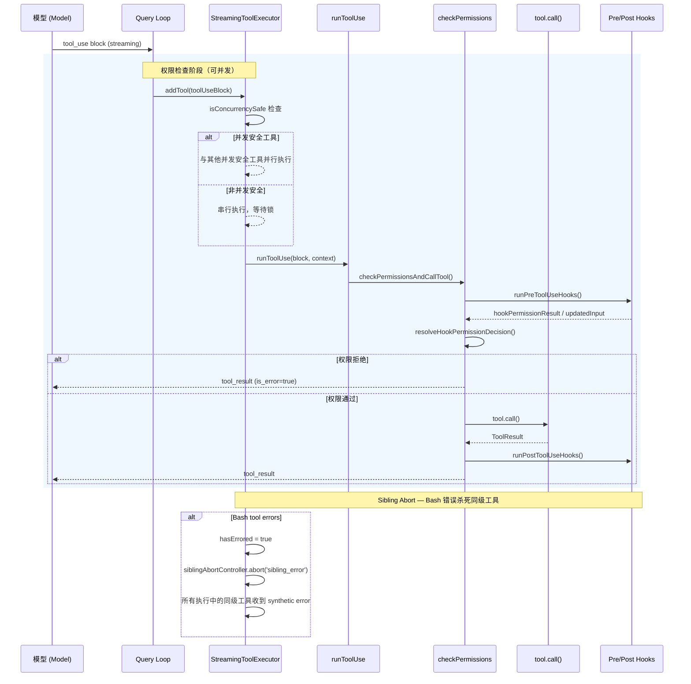
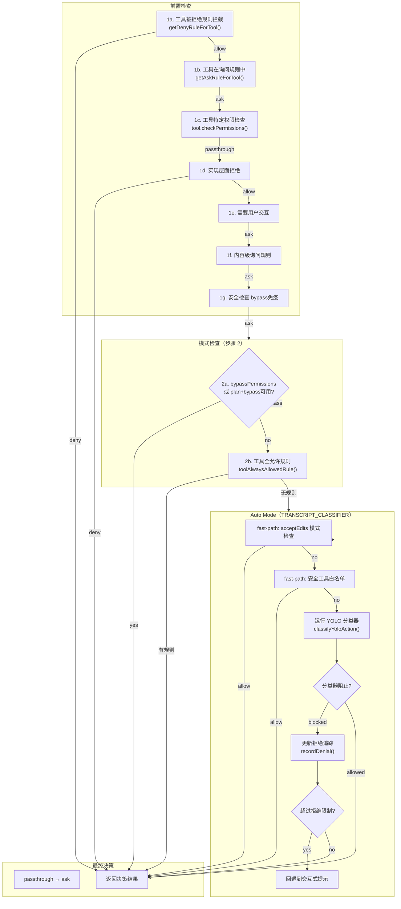

# 第 6 章：Agent Core — 工具执行与权限系统

工具是 Agent 与外部世界交互的唯一通道。Gong Code 通过一套结构化的工具接口定义权限边界，并通过 `StreamingToolExecutor` 实现并发控制与中止语义。本章分析工具接口、运行时上下文、并发执行引擎以及权限决策流程。

## 6.1 Tool 接口定义

每个工具实现 `Tool` 接口（`src/Tool.ts:362-599`），包含元数据、执行逻辑和权限钩子：

```typescript
// src/Tool.ts:362-430
export type Tool<
  Input extends AnyObject = AnyObject,
  Output = unknown,
  P extends ToolProgressData = ToolProgressData,
> = {
  readonly name: string                    // 工具唯一名称，如 "Bash", "Edit"
  readonly inputSchema: Input              // Zod 输入模式，用于运行时验证
  readonly maxResultSizeChars: number      // 结果最大字符数，超出则持久化到磁盘

  // 核心执行
  call(
    args: z.infer<Input>,
    context: ToolUseContext,
    canUseTool: CanUseToolFn,
    parentMessage: AssistantMessage,
    onProgress?: ToolCallProgress<P>,
  ): Promise<ToolResult<Output>>

  // 描述文本（用于 API prompt 中的工具描述）
  description(
    input: z.infer<Input>,
    options: {
      isNonInteractiveSession: boolean
      toolPermissionContext: ToolPermissionContext
      tools: Tools
    },
  ): Promise<string>

  // 并发安全判定 — 并发安全工具可与其他并发安全工具并行执行
  isConcurrencySafe(input: z.infer<Input>): boolean

  // 权限检查
  checkPermissions(
    input: z.infer<Input>,
    context: ToolUseContext,
  ): Promise<PermissionResult>

  // 输入验证（在权限检查之前）
  validateInput?(
    input: z.infer<Input>,
    context: ToolUseContext,
  ): Promise<ValidationResult>

  // 其他元数据方法...
  isEnabled(): boolean
  isReadOnly(input: z.infer<Input>): boolean
  isDestructive?(input: z.infer<Input>): boolean
  interruptBehavior?(): 'cancel' | 'block'
  toAutoClassifierInput(input: z.infer<Input>): unknown
  userFacingName(input: Partial<z.infer<Input>> | undefined): string
  getActivityDescription?(input: Partial<z.infer<Input>> | undefined): string | null
  getToolUseSummary?(input: Partial<z.infer<Input>> | undefined): string | null
  // ...
}
```

### 关键属性说明

**`isConcurrencySafe`** — 决定工具是否可以与其他工具并行执行。读文件、网络请求等无副作用操作返回 `true`；Bash 命令、文件写入等可能产生副作用的操作返回 `false`。系统对非并发安全工具施加串行约束。

**`maxResultSizeChars`** — 当工具结果超过此限制时，结果被持久化到磁盘，模型收到文件路径而非完整内容。这防止大结果撑爆上下文窗口。

**`interruptBehavior`** — 控制用户在新消息到达时是否中断工具：`'cancel'` 停止工具并丢弃结果；`'block'` 保持工具运行，新消息排队等待。

**`checkPermissions`** — 工具特定的权限逻辑（如 Bash 的子命令规则检查）。通常返回 `passthrough`，由中央权限系统（`hasPermissionsToUseTool`）决定最终行为。

**`validateInput`** — Zod 解析之后、权限检查之前的额外验证。例如 GrepTool 可能验证正则表达式合法性。

## 6.2 ToolUseContext 运行时上下文

`ToolUseContext`（`src/Tool.ts:158-300`）是工具执行时的完整环境快照：

```typescript
// src/Tool.ts:158-200
export type ToolUseContext = {
  options: {
    commands: Command[]
    debug: boolean
    mainLoopModel: string
    tools: Tools
    verbose: boolean
    thinkingConfig: ThinkingConfig
    mcpClients: MCPServerConnection[]
    isNonInteractiveSession: boolean
    agentDefinitions: AgentDefinitionsResult
    maxBudgetUsd?: number
    customSystemPrompt?: string
    appendSystemPrompt?: string
    refreshTools?: () => Tools
  }

  // 中止控制器 — 贯穿整个工具执行树
  abortController: AbortController

  // 文件读取状态缓存
  readFileState: FileStateCache

  // 应用状态读写
  getAppState(): AppState
  setAppState(f: (prev: AppState) => AppState): void

  // URL 采集处理（用于 SDK/print 模式的交互式提示）
  handleElicitation?: (
    serverName: string,
    params: ElicitRequestURLParams,
    signal: AbortSignal,
  ) => Promise<ElicitResult>

  // 消息历史
  messages: Message[]

  // 工具决策追踪（用于日志）
  toolDecisions?: Map<string, {
    source: string
    decision: 'accept' | 'reject'
    timestamp: number
  }>

  // 进度工具 ID 集合
  setInProgressToolUseIDs: (f: (prev: Set<string>) => Set<string>) => void
  setHasInterruptibleToolInProgress?: (v: boolean) => void

  // 异步子代理相关
  agentId?: AgentId
  agentType?: string
  localDenialTracking?: DenialTrackingState
  setAppStateForTasks?: (f: (prev: AppState) => AppState) => void

  // 内容替换状态（用于工具结果预算）
  contentReplacementState?: ContentReplacementState

  // ...
}
```

### 核心字段职责

**`abortController`** — 标准 Web AbortController，支持调用树的中止。Bash 工具的子进程监听此信号。

**`getAppState / setAppState`** — 中央状态读写。权限决策、安全检查等模块通过 `getAppState()` 访问 `toolPermissionContext`。

**`messages`** — 当前对话历史，传递给 auto mode 分类器作为上下文。

**`toolDecisions`** — 记录权限决策来源（`session` / `user_permanent` / `user_reject` / `config`），用于 OTel 日志和代码编辑计数。

**`handleElicitation`** — SDK/print 模式下的 URL 采集处理回调。在 REPL 模式下为 `undefined`，使用基于队列的 UI 路径。

## 6.3 工具执行时序

工具执行的完整流程从模型发送 `tool_use` 块开始，经过权限检查、工具调用、结果处理，最终返回给模型：



> **图 6.1: 工具执行时序图** — 来源：[src/services/tools/toolExecution.ts:337](https://github.com/gongzhen/2026/claude-code/blob/main/src/services/tools/toolExecution.ts)

### 执行入口：`runToolUse`

`runToolUse`（`src/services/tools/toolExecution.ts:337`）是工具执行的顶层生成器：

```typescript
// src/services/tools/toolExecution.ts:337-490
export async function* runToolUse(
  toolUse: ToolUseBlock,
  assistantMessage: AssistantMessage,
  canUseTool: CanUseToolFn,
  toolUseContext: ToolUseContext,
): AsyncGenerator<MessageUpdateLazy, void> {
  const tool = findToolByName(toolUseContext.options.tools, toolUse.name)

  if (!tool) {
    yield {
      message: createUserMessage({
        content: [{
          type: 'tool_result',
          content: `<tool_use_error>No such tool: ${toolUse.name}</tool_use_error>`,
          is_error: true,
          tool_use_id: toolUse.id,
        }],
        sourceToolAssistantUUID: assistantMessage.uuid,
      }),
    }
    return
  }

  // 实际执行流：权限检查 → PreHook → tool.call() → PostHook
  for await (const update of streamedCheckPermissionsAndCallTool(...)) {
    yield update
  }
}
```

### 权限检查：`checkPermissionsAndCallTool`

`checkPermissionsAndCallTool`（`src/services/tools/toolExecution.ts:599`）是核心权限执行函数，步骤如下：

1. **Zod 输入解析** — 将模型提供的 JSON 输入与工具的 `inputSchema` 匹配
2. **输入验证** — 调用 `tool.validateInput()` 进行额外验证
3. **PreToolUse Hooks** — 执行所有注册的 PreToolUse 钩子
4. **权限决策** — 调用 `hasPermissionsToUseTool`（权限系统核心）
5. **工具执行** — 权限通过后调用 `tool.call()`
6. **PostToolUse Hooks** — 执行所有注册的 PostToolUse 钩子
7. **错误处理** — 捕获异常，执行 `PostToolUseFailureHooks`

## 6.4 StreamingToolExecutor 并发控制

`StreamingToolExecutor`（`src/services/tools/StreamingToolExecutor.ts`）管理流式工具执行的并发与中止。

### 核心设计原则

```typescript
// src/services/tools/StreamingToolExecutor.ts:40-62
export class StreamingToolExecutor {
  private tools: TrackedTool[] = []
  private hasErrored = false
  private erroredToolDescription = ''
  // 兄弟中止控制器 — Bash 错误时杀死同级子进程
  private siblingAbortController: AbortController
  private discarded = false
}
```

**并发安全工具**（`isConcurrencySafe === true`）— 最多 10 个并行执行，彼此不阻塞。

**非并发安全工具**（`isConcurrencySafe === false`）— 独享执行锁，串行执行。当遇到非并发安全工具时，队列处理暂停，等待该工具完成后才继续。

### 并发判定逻辑

```typescript
// src/services/tools/StreamingToolExecutor.ts:129-135
private canExecuteTool(isConcurrencySafe: boolean): boolean {
  const executingTools = this.tools.filter(t => t.status === 'executing')
  return (
    executingTools.length === 0 ||
    (isConcurrencySafe && executingTools.every(t => t.isConcurrencySafe))
  )
}
```

当一个非并发安全工具进入队列时，只要存在执行中的工具（包括并发安全的），该工具必须等待。只有队列完全空闲或仅存在同类并发安全工具时，才允许执行。

### Sibling Abort（兄弟中止）

Bash 工具错误时，立即向所有同级子进程广播中止信号：

```typescript
// src/services/tools/StreamingToolExecutor.ts:354-364
if (isErrorResult) {
  thisToolErrored = true
  if (tool.block.name === BASH_TOOL_NAME) {
    this.hasErrored = true
    this.erroredToolDescription = this.getToolDescription(tool)
    this.siblingAbortController.abort('sibling_error')
  }
}
```

这是因为 Bash 命令常含有隐式依赖链（如 `mkdir` 失败后 `cd` 无意义），而 Read/WebFetch 等工具彼此独立，一个失败不应影响其他工具。

### 中止原因判定

```typescript
// src/services/tools/StreamingToolExecutor.ts:210-231
private getAbortReason(tool: TrackedTool):
  'sibling_error' | 'user_interrupted' | 'streaming_fallback' | null {
  if (this.discarded) return 'streaming_fallback'
  if (this.hasErrored) return 'sibling_error'
  if (this.toolUseContext.abortController.signal.aborted) {
    if (this.toolUseContext.abortController.signal.reason === 'interrupt') {
      return this.getToolInterruptBehavior(tool) === 'cancel'
        ? 'user_interrupted'
        : null
    }
    return 'user_interrupted'
  }
  return null
}
```

用户按 ESC 拒绝工具时，生成 `REJECT_MESSAGE`；流式回退时，生成 `streaming_fallback` 错误。

### Per-Tool AbortController

每个工具创建子级 `AbortController`，同时监听来自两方的中止：

```typescript
// src/services/tools/StreamingToolExecutor.ts:301-318
const toolAbortController = createChildAbortController(
  this.siblingAbortController,
)
toolAbortController.signal.addEventListener('abort', () => {
  // 非兄弟错误时，将中止向上冒泡到 query 循环
  if (
    toolAbortController.signal.reason !== 'sibling_error' &&
    !this.toolUseContext.abortController.signal.aborted &&
    !this.discarded
  ) {
    this.toolUseContext.abortController.abort(toolAbortController.signal.reason)
  }
}, { once: true })
```

这个设计确保：兄弟错误（`sibling_error`）仅杀死同级工具，不影响 query 循环；权限对话框拒绝的 abort 正确冒泡，触发查询终止（修复了 #21056 回归）。

## 6.5 权限决策流程

权限检查是 Gong Code 安全的核心。`hasPermissionsToUseTool`（`src/utils/permissions/permissions.ts:473`）实现分层决策：



> **图 6.2: 权限决策流程图** — 来源：[src/utils/permissions/permissions.ts:473](https://github.com/gongzhen/2026/claude-code/blob/main/src/utils/permissions/permissions.ts)

### 决策类型说明

| 决策原因 | 类型 | 说明 |
|---------|------|------|
| `rule` | deny/ask/allow | 来自规则文件（userSettings, projectSettings, session 等） |
| `mode` | allow | 当前模式为 `bypassPermissions` 或 `acceptEdits` |
| `hook` | allow/deny | PreToolUse/PermissionRequest 钩子做出的决策 |
| `classifier` | allow/deny | auto mode YOLO 分类器的决策 |
| `safetyCheck` | ask | 敏感路径（.git/, .gong/, shell 配置），bypass 免疫 |
| `subcommandResults` | ask | Bash 子命令需要分别审查 |
| `asyncAgent` | deny | 后台代理中权限提示不可用 |
| `sandboxOverride` | ask | 沙箱排除或禁用 |

### 拒绝追踪（Denial Tracking）

auto mode 使用 `DenialTrackingState` 追踪连续拒绝次数，防止模型在后台循环中被反复阻止：

```typescript
// src/utils/permissions/denialTracking.ts
type DenialTrackingState = {
  consecutiveDenials: number  // 连续被阻止次数
  totalDenials: number         // 累计被阻止次数
}
```

当连续拒绝达到 `DENIAL_LIMITS.consecutive`（默认 5）或累计达到 `DENIAL_LIMITS.maxTotal`（默认 50）时，回退到交互式提示，让用户审查。

## 6.6 权限模式

Gong Code 支持多种权限模式（`src/utils/permissions/PermissionMode.ts`）：

| 模式 | 说明 | 用户交互 |
|------|------|---------|
| `default` | 标准交互式权限提示 | 每次需要时询问 |
| `acceptEdits` | 自动允许文件编辑（工作目录下） | 自动放行 |
| `plan` | 计划模式，bypass 可用时允许 | 一次性确认 |
| `bypassPermissions` | 完全绕过权限检查 | 无需确认 |
| `dontAsk` | 静默拒绝所有需要确认的操作 | 不询问，直接拒绝 |
| `auto`（ANT only） | AI 分类器自动决策 | 分类器决定，允许或阻止 |

### acceptEdits 快速路径

在 `auto` 模式中，系统首先检查 `acceptEdits` 权限是否允许该操作（安全检查），以避免昂贵的分类器 API 调用：

```typescript
// src/utils/permissions/permissions.ts:600-656
const acceptEditsResult = await tool.checkPermissions(parsedInput, {
  ...context,
  getAppState: () => ({
    ...state,
    toolPermissionContext: { ...state.toolPermissionContext, mode: 'acceptEdits' },
  }),
})
if (acceptEditsResult.behavior === 'allow') {
  return { behavior: 'allow', updatedInput: acceptEditsResult.updatedInput, ... }
}
```

## 6.7 Pre/Post Tool Hooks

钩子系统（`src/services/tools/toolHooks.ts`）提供工具执行生命周期的扩展点。

### PreToolUse Hooks

在权限检查前运行，可以修改输入或做出权限决策：

```typescript
// Hook 执行结果类型
type PreToolUseHookResult =
  | { type: 'message'; message: Message }
  | { type: 'hookPermissionResult'; hookPermissionResult: PermissionResult }
  | { type: 'hookUpdatedInput'; updatedInput: Record<string, unknown> }
  | { type: 'preventContinuation'; shouldPreventContinuation: boolean }
  | { type: 'stopReason'; stopReason: string }
  | { type: 'additionalContext'; message: Message }
  | { type: 'stop' }  // 停止工具执行，返回已有消息
```

典型用途：
- **修改输入**：`hookUpdatedInput` 可以在权限检查前转换工具参数
- **阻断执行**：`stop` 类型直接终止工具，返回错误消息
- **权限决策**：`hookPermissionResult` 允许 Hook 直接返回 allow/deny

### PostToolUse Hooks

在工具执行成功后运行，用于日志记录、通知等：

```typescript
// src/services/tools/toolExecution.ts:1483-1531
for await (const hookResult of runPostToolUseHooks(
  toolUseContext, tool, toolUseID, assistantMessage.message.id,
  processedInput, toolOutput, requestId, mcpServerType, mcpServerBaseUrl
)) {
  resultingMessages.push(hookResult)
}
```

### PostToolUseFailureHooks

工具执行失败时运行，用于错误上报、监控等：

```typescript
// src/services/tools/toolExecution.ts:1700-1713
for await (const hookResult of runPostToolUseFailureHooks(
  toolUseContext, tool, toolUseID, messageId, processedInput,
  content, isInterrupt, requestId, mcpServerType, mcpServerBaseUrl
)) {
  hookMessages.push(hookResult)
}
```

### Hook 与权限的协作

`resolveHookPermissionDecision` 协调 PreToolUse 钩子与中央权限系统：

```typescript
// src/services/tools/toolExecution.ts:921-931
const resolved = await resolveHookPermissionDecision(
  hookPermissionResult,  // PreToolUse 钩子返回的权限决策
  tool,
  processedInput,
  toolUseContext,
  canUseTool,
  assistantMessage,
  toolUseID,
)
const permissionDecision = resolved.decision
processedInput = resolved.input
```

当钩子返回 `allow` 但安全检查返回 `ask` 时（`safetyCheck` 类型），安全检查优先级更高，确保 `.git/` 等敏感路径始终需要用户确认。

> **交叉引用**: 工具在沙箱中的安全执行详见 [第 7 章：沙箱与安全系统](./7-sandbox.md)；权限决策与会话状态的交互详见 [第 5 章：会话管理与多级压缩](./5-session.md)。
