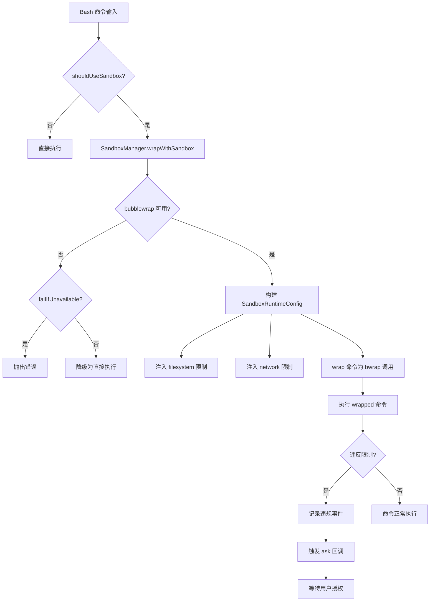
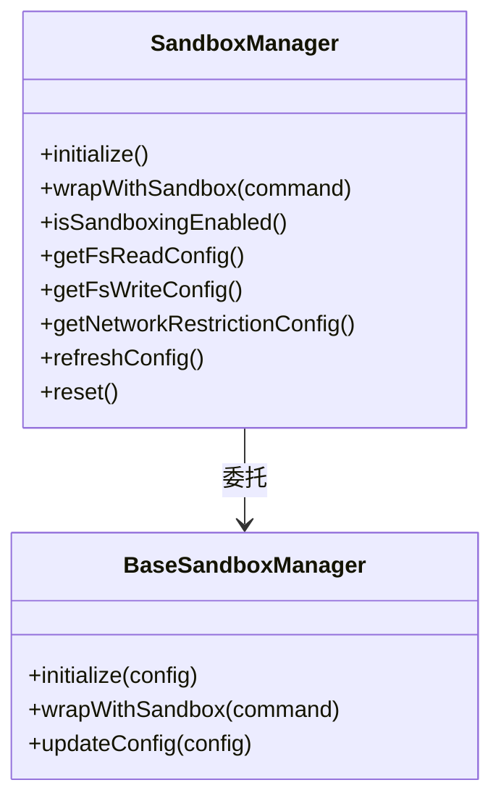
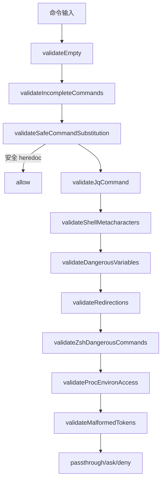
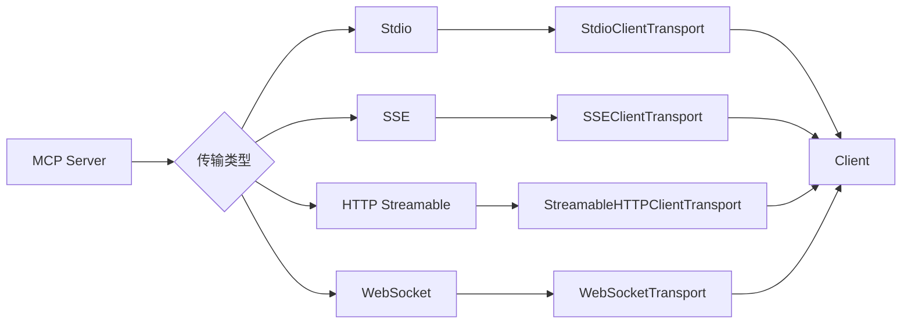
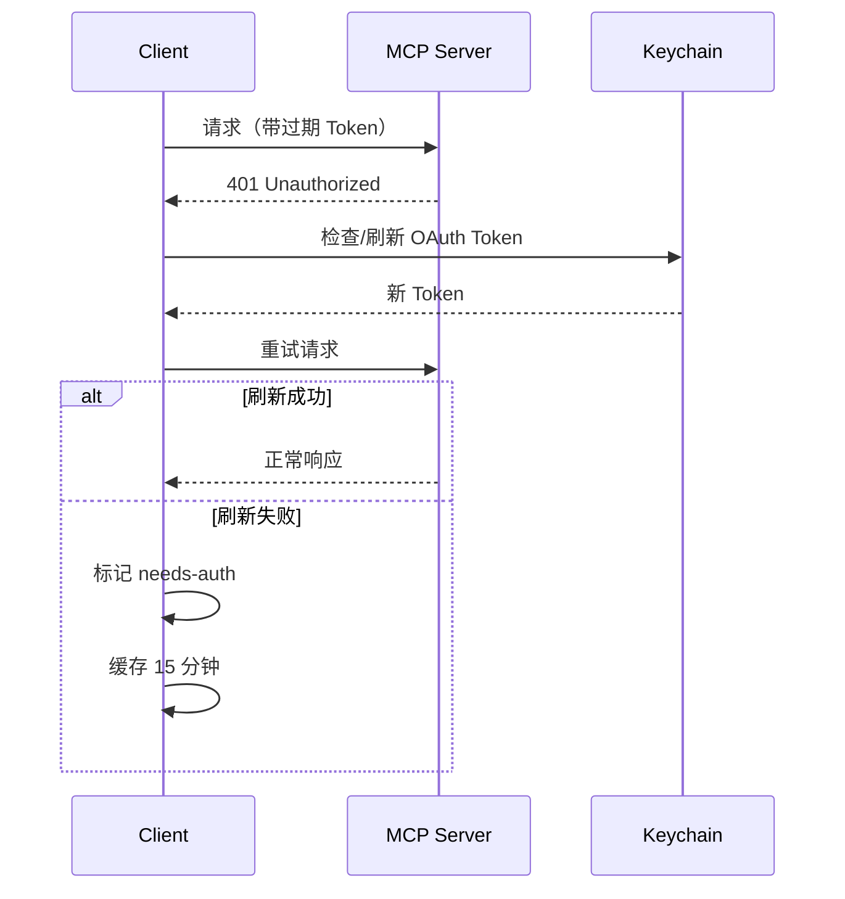

# 第 7 章：沙箱与安全系统

Gong Code 在执行 Bash 命令时提供多层安全防护。沙箱（Sandbox）基于 Linux namespace 和 bubblewrap 将命令限制在隔离环境中运行，配合权限系统实现文件系统、网络访问的精细控制。本章分析沙箱执行流程、安全检查层级、限制配置以及 MCP 集成架构。

## 7.1 沙箱执行流程

### 7.1.1 执行流程图



> **图 7.1: 沙箱执行流程图** — 来源：[src/tools/BashTool/shouldUseSandbox.ts:130](https://github.com/gongzhen/2026/claude-code/blob/main/src/tools/BashTool/shouldUseSandbox.ts)

### 7.1.2 shouldUseSandbox 判断逻辑

`shouldUseSandbox()`（`src/tools/BashTool/shouldUseSandbox.ts:130-153`）决定是否为某条命令启用沙箱：

```typescript
// src/tools/BashTool/shouldUseSandbox.ts:130-153
export function shouldUseSandbox(input: SandboxInput): boolean {
  // 1. 检查沙箱全局开关
  if (!SandboxManager.isSandboxingEnabled()) {
    return false
  }

  // 2. 用户显式禁用时，检查策略是否允许无沙箱命令
  if (
    input.dangerouslyDisableSandbox &&
    SandboxManager.areUnsandboxedCommandsAllowed()
  ) {
    return false
  }

  if (!input.command) {
    return false
  }

  // 3. 用户配置的排除命令（如 npm run test）不走沙箱
  // 注意：excludedCommands 是用户体验功能，非安全边界
  if (containsExcludedCommand(input.command)) {
    return false
  }

  return true
}
```

**判断条件说明：**

| 条件 | 说明 |
|------|------|
| `isSandboxingEnabled()` | 检查平台支持（macOS/Linux/WSL2）、依赖可用性、用户设置 |
| `dangerouslyDisableSandbox` | 用户通过标志显式禁用沙箱 |
| `areUnsandboxedCommandsAllowed()` | 策略设置，默认允许降级 |
| `containsExcludedCommand()` | 用户在 settings 中配置的排除列表 |

## 7.2 SandboxManager 集成

### 7.2.1 架构概览

`SandboxManager`（`src/utils/sandbox/sandbox-adapter.ts`）是 `@anthropic-ai/sandbox-runtime` 的包装层，桥接 Gong Code 的设置系统与沙箱运行时：



> **图 7.2: SandboxManager 架构图** — 来源：[src/utils/sandbox/sandbox-adapter.ts:730](https://github.com/gongzhen/2026/claude-code/blob/main/src/utils/sandbox/sandbox-adapter.ts)

### 7.2.2 初始化流程

```typescript
// src/utils/sandbox/sandbox-adapter.ts:730-792
async function initialize(sandboxAskCallback?: SandboxAskCallback): Promise<void> {
  // 检测是否为 git worktree（需要额外的主仓库写权限）
  if (worktreeMainRepoPath === undefined) {
    worktreeMainRepoPath = await detectWorktreeMainRepoPath(getCwdState())
  }

  const settings = getSettings_DEPRECATED()
  const runtimeConfig = convertToSandboxRuntimeConfig(settings)

  // 初始化基础沙箱管理器
  await BaseSandboxManager.initialize(runtimeConfig, wrappedCallback)

  // 订阅设置变更，动态更新沙箱配置
  settingsSubscriptionCleanup = settingsChangeDetector.subscribe(() => {
    const settings = getSettings_DEPRECATED()
    const newConfig = convertToSandboxRuntimeConfig(settings)
    BaseSandboxManager.updateConfig(newConfig)
  })
}
```

### 7.2.3 平台支持检测

```typescript
// src/utils/sandbox/sandbox-adapter.ts:491-493
const isSupportedPlatform = memoize((): boolean => {
  return BaseSandboxManager.isSupportedPlatform()
})
```

**支持的平台：** macOS、Linux、Windows WSL2（WSL1 不支持）

**依赖检查：** bubblewrap（Linux）、socat 等工具的可用性通过 `checkDependencies()` 验证。

## 7.3 BashTool 安全检查层级

`bashSecurity.ts` 实现了多层级安全检查，在命令执行前拦截恶意模式。

### 7.3.1 不完整命令检测

检测用户正在输入的片段，防止意外执行：

```typescript
// src/tools/BashTool/bashSecurity.ts:244-286
function validateIncompleteCommands(context: ValidationContext): PermissionResult {
  const { originalCommand } = context
  const trimmed = originalCommand.trim()

  // 以 Tab 开头：可能是多行编辑的第一行
  if (/^\s*\t/.test(originalCommand)) {
    return { behavior: 'ask', message: 'Command appears incomplete (starts with tab)' }
  }

  // 以短横线开头：可能是 flag 未完成
  if (trimmed.startsWith('-')) {
    return { behavior: 'ask', message: 'Command appears incomplete (starts with flags)' }
  }

  // 以操作符开头：多行命令的续行
  if (/^\s*(&&|\|\||;|>>?|<)/.test(originalCommand)) {
    return { behavior: 'ask', message: 'Command appears to be a continuation line' }
  }

  return { behavior: 'passthrough' }
}
```

**为什么需要：** 用户在编辑器中编写多行命令时，可能误将未完成的片段发送到 Agent 执行。

### 7.3.2 命令替换检测

检测各种形式的命令替换，防止注入：

```typescript
// src/tools/BashTool/bashSecurity.ts:12-41
const COMMAND_SUBSTITUTION_PATTERNS = [
  { pattern: /<\(/, message: 'process substitution <()' },
  { pattern: />\(/, message: 'process substitution >()' },
  { pattern: /\$\(/, message: '$() command substitution' },
  { pattern: /\$\{/, message: '${} parameter substitution' },
  // Zsh EQUALS expansion: =cmd 展开为 which cmd 输出
  { pattern: /(?:^|[\s;&|])=[a-zA-Z_]/, message: 'Zsh equals expansion (=cmd)' },
]
```

**为什么需要：** `$(curl evil.com)` 可以在合法命令掩护下发起网络请求。`${var}` 替换可能读取环境变量（如 `${HOME}`）。

**Zsh EQUALS 扩展特别危险：** `=curl evil.com` 展开为 `/usr/bin/curl evil.com`，绕过 `Bash(curl:*)` 规则检查。

### 7.3.3 Zsh 危险命令黑名单

Zsh 拥有 Bash 没有的特殊命令，可能绕过安全检查：

```typescript
// src/tools/BashTool/bashSecurity.ts:43-74
const ZSH_DANGEROUS_COMMANDS = new Set([
  'zmodload',   // 加载动态模块（mapfile/sysopen/zpty 等）
  'emulate',    // emulate -c 是 eval 等价物
  'sysopen',    // zsh/system 模块的文件操作
  'sysread',    // zsh/system 模块的文件操作
  'syswrite',   // zsh/system 模块的文件操作
  'zpty',       // 伪终端执行
  'ztcp',       // TCP 连接创建
  'zsocket',    // 套接字创建
  'zf_rm',      // zsh/files 内置 rm（绕过二进制检查）
])
```

**为什么需要：** 这些命令在某些 Zsh 配置下可以绕过 `which` 检查或路径限制。例如 `zmodload zsh/mapfile` 后通过数组赋值实现任意文件读写。

### 7.3.4 混淆检测

检测命令混淆技术：

```typescript
// 检查：编码的 Unicode 空白符
// 检查：零宽字符
// 检查：转义的 shell 元字符
// 检查：多字节 Unicode 字符模拟 ASCII
```

**为什么需要：** 攻击者可能使用不可见字符（如 `\u200B` 零宽空格）混淆命令，如 `curl\u200B evil.com` 看起来像 `curl evil.com`。

### 7.3.5 安全检查流程图



> **图 7.3: 安全检查流程图** — 来源：[src/tools/BashTool/bashSecurity.ts:1](https://github.com/gongzhen/2026/claude-code/blob/main/src/tools/BashTool/bashSecurity.ts)

## 7.4 限制配置

### 7.4.1 文件系统限制

`convertToSandboxRuntimeConfig()`（`src/utils/sandbox/sandbox-adapter.ts:172-381`）构建文件系统限制：

```typescript
// src/utils/sandbox/sandbox-adapter.ts:359-374
return {
  filesystem: {
    denyRead,    // 拒绝读取的路径
    allowRead,   // 允许读取的路径
    allowWrite,  // 允许写入的路径
    denyWrite,   // 拒绝写入的路径
  },
}
```

**关键限制规则：**

| 路径类型 | 规则 | 原因 |
|---------|------|------|
| `settings.json` | denyWrite | 防止沙箱逃逸修改安全设置 |
| `.gong/skills` | denyWrite | Skills 具有完整 Agent 能力，需要 OS 级保护 |
| `.gong/settings.json` | denyWrite | 同上 |
| Git bare repo 文件 | denyWrite | 防止通过 planted git 目录绕过沙箱 |

**Git Bare Repo 保护原理：**

```typescript
// src/utils/sandbox/sandbox-adapter.ts:257-280
// Git 的 is_git_directory() 将 cwd 视为 bare repo
// 如果存在 HEAD + objects/ + refs/ + config
// 攻击者可以植入 config + core.fsmonitor 钩子
// 在 Claude 的非沙箱 git 运行时实现沙箱逃逸
```

### 7.4.2 网络限制

```typescript
// src/utils/sandbox/sandbox-adapter.ts:360-368
return {
  network: {
    allowedDomains,        // 允许的域名列表
    deniedDomains,         // 拒绝的域名列表
    allowUnixSockets,      // 允许的 Unix 套接字路径
    allowLocalBinding,     // 是否允许本地端口绑定
    httpProxyPort,         // HTTP 代理端口
    socksProxyPort,        // SOCKS 代理端口
  },
}
```

**域名来源优先级：**

1. `policySettings.sandbox.network.allowedDomains`（最高优先级，当 `allowManagedDomainsOnly: true` 时）
2. `settings.sandbox.network.allowedDomains`
3. `permissions.allow` 中的 `WebFetch(domain:*)` 规则

### 7.4.3 限制配置类型定义

```typescript
// 来自 @anthropic-ai/sandbox-runtime
type FsReadRestrictionConfig = {
  denyRead: string[]
  allowRead: string[]
}

type FsWriteRestrictionConfig = {
  denyWrite: string[]
  allowWrite: string[]
}

type NetworkRestrictionConfig = {
  allowedDomains: string[]
  deniedDomains: string[]
  allowUnixSockets?: string[]
  allowLocalBinding?: boolean
  httpProxyPort?: number
  socksProxyPort?: number
}
```

## 7.5 MCP 集成架构

### 7.5.1 多传输支持

MCP 客户端（`src/services/mcp/client.ts`）支持多种传输协议：



> **图 7.4: MCP 多传输支持架构** — 来源：[src/services/mcp/client.ts:1](https://github.com/gongzhen/2026/claude-code/blob/main/src/services/mcp/client.ts)

### 7.5.2 工具命名规范

MCP 工具通过 `mcp__<serverName>__<toolName>` 格式暴露给 Agent：

```typescript
// src/services/mcp/mcpStringUtils.ts
export function buildMcpToolName(
  serverName: string,
  toolName: string,
): string {
  return `mcp__${serverName}__${toolName}`
}
```

**为什么需要命名空间隔离：** 多个 MCP 服务器可能提供同名工具（如 `filesystem.read`），命名空间防止冲突。

### 7.5.3 认证错误处理

```typescript
// src/services/mcp/client.ts:153-160
export class McpAuthError extends Error {
  serverName: string
  constructor(serverName: string, message: string) {
    super(message)
    this.name = 'McpAuthError'
    this.serverName = serverName
  }
}
```

**401 处理流程：**



> **图 7.5: MCP 认证错误处理时序图** — 来源：[src/services/mcp/client.ts:153](https://github.com/gongzhen/2026/claude-code/blob/main/src/services/mcp/client.ts)

**needs-auth 状态：** 当服务器返回认证错误且无法刷新时，连接进入 `needs-auth` 状态，用户需要通过 `/mcp auth` 命令重新授权。

### 7.5.4 MCP 集成与沙箱的关系

MCP 工具在沙箱外部执行。沙箱主要保护 Bash 命令执行，而 MCP 工具通过各自的协议传输直接与外部服务通信。Gong Code 通过权限系统（`permissions.allow`）控制哪些 MCP 服务器可以连接。

## 7.6 安全性设计原则

### 7.6.1 纵深防御

每层安全机制独立运作，一层被突破不影响其他层：

1. **沙箱层：** 操作系统级隔离（namespace/cgroup）
2. **权限层：** 用户配置的路径/命令规则
3. **BashTool 层：** 命令语法和模式检查
4. **API 层：** 模型无法直接执行命令，需通过工具

### 7.6.2 安全边界认知

**沙箱是真正的安全边界。** `excludedCommands`（在 `settings.sandbox.excludedCommands` 中配置）是用户体验功能，不是安全边界——用户可以绕过它，但沙箱权限系统仍会提示授权。

**原因：** 用户可能需要排除某些命令以避免性能开销（如频繁的 `git status`），但这不应该导致未预期的安全降级。真正的安全控制是沙箱的 `allowWrite`/`denyWrite` 路径限制。

### 7.6.3 设置锁定

政策设置（`policySettings`）可以锁定沙箱配置，防止用户降级安全设置：

```typescript
// src/utils/sandbox/sandbox-adapter.ts:647-664
function areSandboxSettingsLockedByPolicy(): boolean {
  const overridingSources = ['flagSettings', 'policySettings']
  for (const source of overridingSources) {
    const settings = getSettingsForSource(source)
    if (settings?.sandbox?.enabled !== undefined) {
      return true
    }
  }
  return false
}
```

当 `policySettings` 或 `flagSettings` 中设置了 `sandbox.enabled` 时，用户的本地设置无法覆盖。

> **交叉引用**: 沙箱中的 Bash 工具通过权限系统执行，详见 [第 6 章：工具执行与权限系统](./6-tool-execution.md)；沙箱与会话状态管理的交互详见 [第 5 章：会话管理与多级压缩](./5-session.md)。
