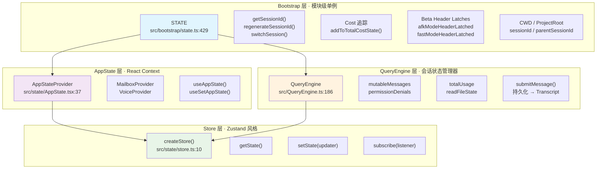
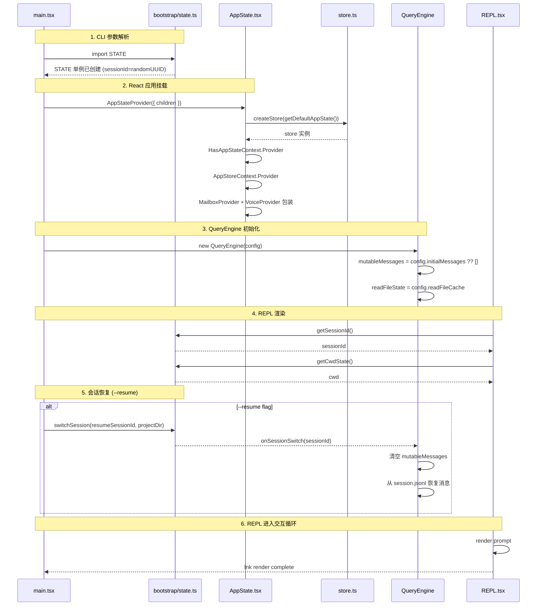

# 第 8 章：状态管理 — 分层状态架构

Gong Code 采用分层状态管理设计，按职责划分为三个层次：**Bootstrap State**（会话级单例）、**AppState**（React 应用状态）、**Store**（Zustand 风格的不可变状态容器）。各层边界清晰、数据流单向：Bootstrap 层处理会话元数据（如 sessionId、cost 追踪），AppState 层管理 React 组件树中的全局 UI 状态，Store 层提供细粒度的响应式订阅机制。

## 8.1 状态管理层次图



> **图 8.1: 状态管理层次图** — 来源：[src/bootstrap/state.ts:429](https://github.com/gongzhen/2026/claude-code/blob/main/src/bootstrap/state.ts)

**层次职责划分**：

| 层次 | 文件 | 职责 | 持久化 |
|------|------|------|--------|
| Bootstrap | `src/bootstrap/state.ts` | sessionId、cost、cwd、projectRoot、beta latches | 否（进程存活期内） |
| QueryEngine | `src/QueryEngine.ts` | 消息历史、文件缓存、用量统计、权限记录 | session.jsonl |
| AppState | `src/state/AppState.tsx` | React Context 容器、settings 同步、hook 导出 | 否 |
| Store | `src/state/store.ts` | 通用响应式状态容器（fileHistory、promptSuggestion 等） | 否 |

## 8.2 Bootstrap State — 模块级单例

`src/bootstrap/state.ts:429` 定义了模块级单例 `STATE`，在整个进程生命周期内保持唯一。相比 React 的 module-level state（如 `useState` 的闭包捕获），单例确保跨模块访问无需 prop drilling，且无需担心 React tree 的生命周期问题。

### 8.2.1 STATE 单例的创建

`getInitialState()` 函数初始化完整的状态对象，包含 100+ 个字段：

```typescript
// src/bootstrap/state.ts:260-426
function getInitialState(): State {
  // 解析 cwd 并规范化路径（处理 symlink）
  let resolvedCwd = ''
  // ...
  const state: State = {
    originalCwd: resolvedCwd,
    projectRoot: resolvedCwd,
    sessionId: randomUUID() as SessionId,
    totalCostUSD: 0,
    // ... 100+ 字段
  }
  return state
}

// src/bootstrap/state.ts:429
const STATE: State = getInitialState()
```

### 8.2.2 SessionId 管理

SessionId 是会话身份的核心标识，用于：

- transcript 文件命名（`<sessionId>.jsonl`）
- plan slug 生成（`planSlugCache`）
- session 恢复（`--resume`）

```typescript
// src/bootstrap/state.ts:431-478
export function getSessionId(): SessionId {
  return STATE.sessionId
}

/**
 * 重新生成 sessionId，可选地将当前设为父会话。
 * 调用点：REPL.tsx clearContext（/clear 命令）
 */
export function regenerateSessionId(
  options: { setCurrentAsParent?: boolean } = {},
): SessionId {
  if (options.setCurrentAsParent) {
    STATE.parentSessionId = STATE.sessionId
  }
  // 清理旧 session 的 plan slug 缓存，防止 Map 无限增长
  STATE.planSlugCache.delete(STATE.sessionId)
  STATE.sessionId = randomUUID() as SessionId
  STATE.sessionProjectDir = null
  return STATE.sessionId
}

/**
 * 原子性地切换会话。sessionId 和 sessionProjectDir 必须一起变化，
 * 避免单独 setter 导致二者不同步（CC-34）。
 */
export function switchSession(
  sessionId: SessionId,
  projectDir: string | null = null,
): void {
  STATE.planSlugCache.delete(STATE.sessionId)
  STATE.sessionId = sessionId
  STATE.sessionProjectDir = projectDir
  sessionSwitched.emit(sessionId)
}

const sessionSwitched = createSignal<[id: SessionId]>()
export const onSessionSwitch = sessionSwitched.subscribe
```

### 8.2.3 Cost 追踪

Cost 追踪贯穿整个会话，累加 API 调用和工具执行的消耗：

```typescript
// src/bootstrap/state.ts:557-568
export function addToTotalCostState(
  cost: number,
  modelUsage: ModelUsage,
  model: string,
): void {
  STATE.modelUsage[model] = modelUsage
  STATE.totalCostUSD += cost
}

export function getTotalCostUSD(): number {
  return STATE.totalCostUSD
}

// src/bootstrap/state.ts:543-549
export function addToTotalDurationState(
  duration: number,
  durationWithoutRetries: number,
): void {
  STATE.totalAPIDuration += duration
  STATE.totalAPIDurationWithoutRetries += durationWithoutRetries
}
```

### 8.2.4 Beta Header Latches

Beta header latches 是「粘滞锁」—— 一旦激活，整个会话期间保持开启，避免频繁切换 busting 掉 prompt cache：

```typescript
// src/bootstrap/state.ts:229-249
// Sticky-on latch for AFK_MODE_BETA_HEADER
afkModeHeaderLatched: boolean | null
// Sticky-on latch for FAST_MODE_BETA_HEADER
fastModeHeaderLatched: boolean | null
// Sticky-on latch for cache-editing beta header
cacheEditingHeaderLatched: boolean | null
// Sticky-on latch for clearing thinking from prior tool loops
thinkingClearLatched: boolean | null
```

```typescript
// src/bootstrap/state.ts:1744-1749
/**
 * 重置所有 beta header latches。在 /clear 和 /compact 时调用，
 * 确保新对话重新评估 header。
 */
export function clearBetaHeaderLatches(): void {
  STATE.afkModeHeaderLatched = null
  STATE.fastModeHeaderLatched = null
  STATE.cacheEditingHeaderLatched = null
  STATE.thinkingClearLatched = null
}
```

**latch 行为**：以 `afkModeHeaderLatched` 为例——首次 auto mode 激活时设为 `true`，之后即使 Shift+Tab 退出 auto mode 也不重置为 `false`。这是因为 prompt cache 已被 warm，频繁切换会导致 cache miss。

## 8.3 AppState — React Context Provider

`AppStateProvider`（`src/state/AppState.tsx:37`）是 React 应用状态的根容器，提供：

1. **MailboxProvider** — 邮箱上下文（子 agent 消息传递）
2. **VoiceProvider**（条件） — 语音模式（`feature('VOICE_MODE')` 时注入）
3. **Settings 同步** — 远程设置变更时自动更新 store

### 8.3.1 AppStateProvider 结构

```typescript
// src/state/AppState.tsx:37-110
export function AppStateProvider(t0) {
  const { children, initialState, onChangeAppState } = t0
  const hasAppStateContext = useContext(HasAppStateContext)
  if (hasAppStateContext) {
    throw new Error("AppStateProvider can not be nested within another AppStateProvider")
  }

  // 创建 store 实例（仅首次或 initialState/onChangeAppState 变化时重建）
  const [store] = useState(() =>
    createStore(initialState ?? getDefaultAppState(), onChangeAppState)
  )

  // 处理 bypass permissions 模式（远程设置先于 mount 加载时禁用）
  useEffect(() => {
    const { toolPermissionContext } = store.getState()
    if (toolPermissionContext.isBypassPermissionsModeAvailable && isBypassPermissionsModeDisabled()) {
      store.setState(_temp)
    }
  }, [store])

  // 包装 MailboxProvider + VoiceProvider
  const wrappedChildren = (
    <MailboxProvider>
      <VoiceProvider>{children}</VoiceProvider>
    </MailboxProvider>
  )

  return (
    <HasAppStateContext.Provider value={true}>
      <AppStoreContext.Provider value={store}>
        {wrappedChildren}
      </AppStoreContext.Provider>
    </HasAppStateContext.Provider>
  )
}
```

### 8.3.2 AppState 的核心 Hooks

AppState 导出三个核心 Hook，供 React 组件使用：

```typescript
// src/state/AppState.tsx:142-163
/**
 * 订阅 AppState 的某个切片。只在选中的值变化时 re-render
 *（通过 Object.is 比较）。多字段独立订阅请多次调用：
 *   const verbose = useAppState(s => s.verbose)
 *   const model = useAppState(s => s.mainLoopModel)
 */
export function useAppState<R>(selector: (state: AppState) => R): R {
  const store = useAppStore()
  return useSyncExternalStore(store.subscribe, get, get)
  // get = () => selector(store.getState())
}

// src/state/AppState.tsx:170-172
/**
 * 获取 setAppState updater（不订阅），返回稳定引用，永不 re-render。
 */
export function useSetAppState() {
  return useAppStore().setState
}

// src/state/AppState.tsx:177-179
/**
 * 直接获取 store（用于将 getState/setState 传递给非 React 代码）。
 */
export function useAppStateStore() {
  return useAppStore()
}
```

**重要约束**：selector 不应返回新对象——`Object.is` 会将其视为变化，触发不必要 re-render：

```typescript
// 正确：返回现有子对象引用
const { text, promptId } = useAppState(s => s.promptSuggestion)

// 错误：返回新对象，每次都是新引用
const suggestion = useAppState(s => ({ ...s.promptSuggestion }))
```

## 8.4 Store 模式 — Zustand 风格的不可变更新

`src/state/store.ts:10` 实现了通用的响应式状态容器，核心 API 为 `getState`、`setState`、`subscribe`：

```typescript
// src/state/store.ts:1-34
type Listener = () => void
type OnChange<T> = (args: { newState: T; oldState: T }) => void

export type Store<T> = {
  getState: () => T
  setState: (updater: (prev: T) => T) => void
  subscribe: (listener: Listener) => () => void
}

export function createStore<T>(
  initialState: T,
  onChange?: OnChange<T>,
): Store<T> {
  let state = initialState
  const listeners = new Set<Listener>()

  return {
    getState: () => state,

    setState: (updater: (prev: T) => T) => {
      const prev = state
      const next = updater(prev)
      if (Object.is(next, prev)) return  // 不可变更新：引用相同则跳过
      state = next
      onChange?.({ newState: next, oldState: prev })
      for (const listener of listeners) listener()
    },

    subscribe: (listener: Listener) => {
      listeners.add(listener)
      return () => listeners.delete(listener)  // 返回取消订阅函数
    },
  }
}
```

### 8.4.1 不可变更新语义

`setState` 的 updater 函数遵循 **immutable update pattern**：

```typescript
// 正确：返回新对象
store.setState(prev => ({
  ...prev,
  fileHistory: updater(prev.fileHistory),
}))

// 错误：直接修改
store.setState(prev => {
  prev.fileHistory = newState  // 违反不可变原则
  return prev
})
```

`Object.is(next, prev)` 比较确保只有实际变化才触发通知。

### 8.4.2 订阅机制

`subscribe` 返回一个取消订阅函数，支持组件级别的细粒度订阅：

```typescript
// 在 useAppState 中的使用
return useSyncExternalStore(store.subscribe, get, get)

// 直接使用
const unsubscribe = store.subscribe(() => {
  console.log('state changed:', store.getState())
})
// 清理时取消订阅
unsubscribe()
```

### 8.4.3 OnChange 回调

`onChange` 回调在每次状态变化时触发，可用于：

- 调试（`logForDebugging`）
- 外部同步（如 settings 变更）
- 持久化触发

## 8.5 State 初始化流程时序图

从进程启动到 REPL 可交互状态的完整初始化流程：



> **图 8.2: State 初始化流程时序图** — 来源：[src/bootstrap/state.ts:429](https://github.com/gongzhen/2026/claude-code/blob/main/src/bootstrap/state.ts)

### 8.5.1 各层状态初始化顺序

| 顺序 | 阶段 | 初始化内容 | 文件 |
|------|------|-----------|------|
| 1 | CLI 解析 | 解析 --resume, --worktree 等 flag | `main.tsx` |
| 2 | Bootstrap | 创建 STATE 单例，生成 sessionId | `bootstrap/state.ts:429` |
| 3 | AppState | 创建 store，注册 onChange 回调 | `AppState.tsx:50` |
| 4 | QueryEngine | 初始化消息历史、文件缓存 | `QueryEngine.ts:92` |
| 5 | REPL | 获取 sessionId、cwd，开始渲染 | `REPL.tsx` |

## 8.6 跨层状态交互

### 8.6.1 Bootstrap → AppState

Bootstrap 层通过 `useSettingsChange` hook 向 AppState 同步远程设置变更：

```typescript
// src/state/AppState.tsx:82-91
// onSettingsChange = source => applySettingsChange(source, store.setState)
useSettingsChange(onSettingsChange)
```

### 8.6.2 QueryEngine → Store

QueryEngine 通过 `setAppState` 更新文件历史快照：

```typescript
// src/QueryEngine.ts:645-659
void fileHistoryMakeSnapshot(
  (updater: (prev: FileHistoryState) => FileHistoryState) => {
    setAppState(prev => ({
      ...prev,
      fileHistory: updater(prev.fileHistory),
    }))
  },
  message.uuid,
)
```

### 8.6.3 Bootstrap → QueryEngine

Session 切换时，Bootstrap 的 `onSessionSwitch` 通知 QueryEngine 清理状态：

```typescript
// concurrentSessions.ts 使用 onSessionSwitch
export const onSessionSwitch = sessionSwitched.subscribe
```

## 8.7 总结

本章分析了 Gong Code 的分层状态管理架构：

1. **Bootstrap State** (`src/bootstrap/state.ts`)：模块级单例 `STATE` 管理会话元数据，包括 sessionId 生命周期的三个函数（`getSessionId`、`regenerateSessionId`、`switchSession`）、Cost 追踪、以及 beta header latches。进程级单例避免了跨模块 prop drilling。

2. **AppState** (`src/state/AppState.tsx`)：`AppStateProvider` 作为 React Context 根容器，包装 `MailboxProvider` 和条件性的 `VoiceProvider`，并通过 `useSettingsChange` hook 同步远程设置。三个导出 Hook（`useAppState`、`useSetAppState`、`useAppStateStore`）提供响应式访问。

3. **Store 模式** (`src/state/store.ts`)：`createStore` 实现 Zustand 风格的状态容器，核心为 `getState`、`setState`（不可变更新 + `Object.is` 跳过无变化）、`subscribe`（Set-based listeners + 取消订阅返回值）。

4. **初始化流程**：从 CLI 参数解析 → Bootstrap 单例创建 → AppState store 初始化 → QueryEngine 初始化 → REPL 渲染，顺序清晰，每层只依赖其下层。

5. **跨层数据流**：Bootstrap 通过 hook 写 AppState、QueryEngine 通过 `setAppState` 写 Store、Bootstrap 通过 signal 通知 QueryEngine session 切换。

下一章我们将分析工具执行系统（Tool Execution），了解 Gong Code 如何在沙箱中安全地执行文件系统操作和 Shell 命令。

> **交叉引用**: 状态管理是整个系统的基础，与各章节都有交互：[第 4 章：查询循环](./4-query-loop.md)、[第 5 章：会话管理](./5-session.md)、[第 6 章：工具执行](./6-tool-execution.md)、[第 7 章：沙箱安全](./7-sandbox.md)。
