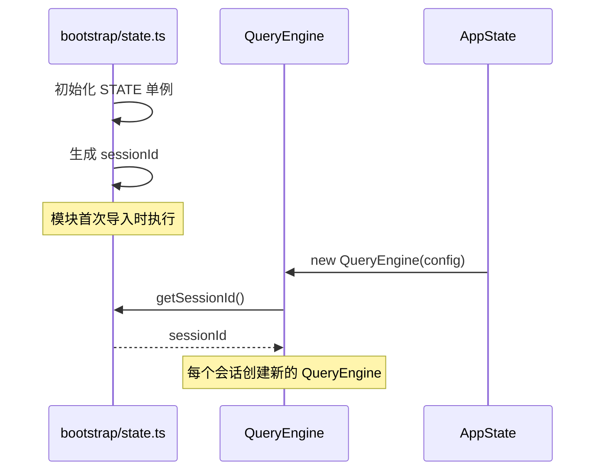

# Gong Code 技术文档网站实现计划

> **For agentic workers:** REQUIRED SUB-SKILL: Use superpowers:subagent-driven-development (recommended) or superpowers:executing-plans to implement this plan task-by-task. Steps use checkbox (`- [ ]`) syntax for tracking.

**Goal:** 创建一个详细的技术文档网站，通过图表和代码解析让中级开发者理解 Gong Code 架构，并能自己实现类似项目

**Architecture:** 基于 VitePress + Mermaid 的静态文档网站，每章围绕一个核心模块，配有架构图/时序图/流程图

**Tech Stack:** VitePress 1.x, Mermaid, Markdown, highlight.js

---

## 文件结构

```
docs/
├── .vitepress/
│   └── config.ts          # VitePress 配置（导航栏、侧边栏、Mermaid 主题）
├── index.md               # 文档首页
├── chapters/
│   ├── 1-intro.md         # 项目概览与设计思想
│   ├── 2-entry.md         # 入口与启动流程
│   ├── 3-provider.md      # API 多 Provider 架构
│   ├── 4-query-loop.md     # Agent 编排核心 - 查询循环
│   ├── 5-session.md       # Agent 编排核心 - 会话与压缩
│   ├── 6-tool-execution.md # Agent 编排核心 - 工具执行
│   ├── 7-sandbox.md       # 沙箱与安全系统
│   └── 8-state.md         # 状态管理
└── public/                # 静态资源（如有）
```

---

## Task 1: 创建 VitePress 基础配置

**Files:**
- Create: `docs/.vitepress/config.ts`

- [ ] **Step 1: 创建 VitePress 配置**

```typescript
import { defineConfig } from 'vitepress'

export default defineConfig({
  title: 'Gong Code 架构解析',
  description: '深入理解 Gong Code 的核心架构设计',
  srcDir: '.',
  themeConfig: {
    nav: [
      { text: '首页', link: '/' },
      { text: '快速开始', link: '/chapters/1-intro' },
    ],
    sidebar: [
      {
        text: '目录',
        items: [
          { text: '1. 项目概览与设计思想', link: '/chapters/1-intro' },
          { text: '2. 入口与启动流程', link: '/chapters/2-entry' },
          { text: '3. API 多 Provider 架构', link: '/chapters/3-provider' },
          { text: '4. 查询循环', link: '/chapters/4-query-loop' },
          { text: '5. 会话与压缩', link: '/chapters/5-session' },
          { text: '6. 工具执行', link: '/chapters/6-tool-execution' },
          { text: '7. 沙箱与安全', link: '/chapters/7-sandbox' },
          { text: '8. 状态管理', link: '/chapters/8-state' },
        ],
      },
    ],
  },
  mermaid: {
    theme: 'base',
    themeVariables: {
      primaryColor: '#e66465',
      primaryTextColor: '#fff',
      lineColor: '#333',
    },
  },
  markdown: {
    lineNumbers: true,
  },
})
```

- [ ] **Step 2: 创建首页 index.md**

Create `docs/index.md`:

```markdown
---
layout: home
hero:
  name: "Gong Code 架构解析"
  text: "深入理解 AI 编程助手的核心设计"
  actions:
    - theme: brand
      text: 开始阅读 →
      link: /chapters/1-intro
---
```

- [ ] **Step 3: 测试 docs:dev 能否启动**

Run: `cd /Users/gongzhen/code/2026/claude-code && bun run docs:dev`

Expected: VitePress dev server starts without errors

- [ ] **Step 4: 提交**

```bash
git add docs/.vitepress/config.ts docs/index.md
git commit -m "docs: add VitePress config and homepage"
```

---

## Task 2: 编写第 1 章 - 项目概览与设计思想

**Files:**
- Create: `docs/chapters/1-intro.md`

- [ ] **Step 1: 编写第 1 章内容**

```markdown
# 项目概览与设计思想

## 什么是 Gong Code

Gong Code 是一个运行在终端的 AI 编程助手，支持多模型提供商（MiniMax、GLM、OpenAI 兼容 API）。

## 核心设计哲学

### 1. Provider 抽象

Gong Code 通过 Provider 适配器模式支持多个模型厂商：

```typescript
// src/services/api/providers/types.ts
interface ModelProvider {
  name: string
  capabilities: {
    streaming: boolean
    toolUse: boolean
    vision: boolean
    thinking: boolean
    systemPrompt: boolean
    maxContextLength: number
    maxOutputTokens: number
  }
  chat(messages, options): AsyncGenerator<StreamEvent>
  chatSync?(messages, options): AssistantMessage
}
```

### 2. 工具抽象

所有能力都通过 Tool 接口扩展：

```typescript
// src/Tool.ts
interface Tool<Input, Output, P> {
  name: string
  inputSchema: Input
  call(args, context, canUseTool, parentMessage, onProgress): Promise<ToolResult<Output>>
  isConcurrencySafe(input): boolean
  checkPermissions(input, context): Promise<PermissionResult>
}
```

### 3. 状态分离

- **Bootstrap State**: 模块级单例，管理 SessionId、Cost 追踪
- **AppState**: React Context，管理应用级状态（主题、消息、任务列表）
- **QueryEngine State**: 会话级状态，管理消息历史、压缩边界

## 整体架构图

::: mermaid
graph TB
    subgraph "入口层"
        CLI[cli.tsx - Polyfill] --> MAIN[main.tsx - Commander]
        MAIN --> REPL[REPL 启动]
    end

    subgraph "Agent 核心"
        QE[QueryEngine] --> Q[query.ts - 查询循环]
        Q --> TOOLS[工具系统]
        Q --> COMPACT[压缩系统]
    end

    subgraph "API 层"
        TOOLS --> PROVIDER[Provider Registry]
        PROVIDER --> MINI[MiniMax Adapter]
        PROVIDER --> GLM[GLM Adapter]
        PROVIDER --> OPENAI[OpenAI Compat]
    end

    subgraph "工具层"
        TOOLS --> BASH[BashTool]
        TOOLS --> FILE[FileEditTool]
        TOOLS --> GREP[GrepTool]
        TOOLS --> MCP[MCPTool]
    end

    REPL --> UI[Ink UI]
    QE --> UI
:::

## 关键路径

1. **启动路径**: cli.tsx → main.tsx → replLauncher.tsx → ink.ts → render()
2. **查询路径**: QueryEngine.submitMessage() → query() → queryModelWithStreaming() → Provider.chat()
3. **工具路径**: QueryEngine → toolExecution.ts → StreamingToolExecutor → Tool.call()
```

- [ ] **Step 2: 提交**

```bash
git add docs/chapters/1-intro.md
git commit -m "docs: add chapter 1 - project overview and design philosophy"
```

---

## Task 3: 编写第 2 章 - 入口与启动流程

**Files:**
- Create: `docs/chapters/2-entry.md`

- [ ] **Step 1: 编写第 2 章内容**

```markdown
# 入口与启动流程

## cli.tsx - 真正的入口点

`src/entrypoints/cli.tsx` 是应用真正的入口，负责：

### 1. Provider 配置加载

在所有导入之前执行，确保 API 配置可用：

```typescript
// src/entrypoints/cli.tsx:12-64
const configPath = path.join(os.homedir(), '.gong', 'providers.json')
const config = JSON.parse(await fs.readFile(configPath, 'utf-8'))
process.env.MODEL_PROVIDER = config.provider || 'minimax'
process.env.ANTHROPIC_API_KEY = config.apiKey
```

### 2. Polyfill 系统

模拟构建时宏注入，让代码在不同环境有一致行为：

```typescript
// src/entrypoints/cli.tsx:79-95
const feature = (_name: string) => false  // 所有特性开关关闭

globalThis.MACRO = {
  VERSION: "0.1.6",
  BUILD_TIME: new Date().toISOString(),
  FEEDBACK_CHANNEL: "",
}

globalThis.BUILD_TARGET = "external"
globalThis.BUILD_ENV = "production"
globalThis.INTERFACE_TYPE = "stdio"
```

### 3. 快速路径

特殊命令不需要启动完整 REPL：

```typescript
// src/entrypoints/cli.tsx:140-393
if (args.dumpSystemPrompt) {
  // 输出系统提示后退出
}
if (args.version) {
  // 输出版本后退出
}
if (args.daemonWorker) {
  // 后台工作模式
}
```

## main.tsx - Commander.js CLI 定义

解析命令行参数，启动对应模式：

```typescript
// src/main.tsx
import { Command } from 'commander'
import { launchRepl } from './replLauncher'

const program = new Command()
program
  .name('gong-code')
  .description('AI coding assistant in the terminal')
  .argument('[prompt]', 'Initial prompt')
  .option('-p, --pipe', 'Pipe mode')
  .action(async (prompt, options) => {
    await launchRepl({ initialPrompt: prompt, pipeMode: options.pipe })
  })
```

## REPL 启动流程

::: mermaid
sequenceDiagram
    participant main as main.tsx
    participant launcher as replLauncher.tsx
    participant ink as ink.ts
    participant repl as REPL.tsx
    participant render as Ink Render

    main->>launcher: launchRepl(options)
    launcher->>ink: render(<REPL />)
    ink->>repl: <AppStateProvider><REPL /></AppStateProvider>
    repl->>render: render()
    Note over render: Ink 渲染到终端
```

### 关键文件职责

| 文件 | 职责 |
|------|------|
| `cli.tsx` | Polyfill、Provider 配置、快速路径 |
| `main.tsx` | CLI 参数解析、启动模式选择 |
| `replLauncher.tsx` | REPL 组件包装 |
| `ink.ts` | Ink 渲染封装、ThemeProvider |
| `screens/REPL.tsx` | 主 REPL 界面（258KB）|

## Ink 渲染原理

Ink 是 React 的终端渲染引擎：

```typescript
// src/ink.ts
import { render } from 'ink'
import { ThemeProvider } from './components/design-system/ThemeProvider'

export async function render(node: ReactNode, options?): Promise<Instance> {
  return inkRender(
    <ThemeProvider>
      {node}
    </ThemeProvider>,
    options
  )
}
```

## 思考题

1. 为什么 Provider 配置要在 cli.tsx 最开始加载，而不是在 main.tsx？
2. feature() 始终返回 false 有什么作用？
3. Ink 和 React 的区别是什么？
```

- [ ] **Step 2: 提交**

```bash
git add docs/chapters/2-entry.md
git commit -m "docs: add chapter 2 - entry and startup flow"
```

---

## Task 4: 编写第 3 章 - API 多 Provider 架构

**Files:**
- Create: `docs/chapters/3-provider.md`

- [ ] **Step 1: 编写第 3 章内容**

```markdown
# API 多 Provider 架构

## Provider 架构图

::: mermaid
graph TB
    subgraph "API 层入口"
        Q[query.ts] --> CALL[callModel()]
    end

    subgraph "Provider Registry"
        REG[ProviderRegistry] --> GET[getProvider()]
        GET --> MINI[MiniMaxAdapter]
        GET --> GLM[GLMAdapter]
        GET --> OPENAI[OpenAICompatAdapter]
        GET --> ANTH[AnthropicAdapter]
    end

    subgraph "适配器"
        MINI --> HTTP[HTTP Client]
        GLM --> HTTP
        OPENAI --> HTTP
        ANTH --> SDK[Anthropic SDK]
    end

    subgraph "流式事件"
        HTTP --> EVENTS[StreamEvents]
        EVENTS --> CONV[格式转换]
        CONV --> UI[QueryEngine]
    end
:::

## ProviderRegistry 单例

```typescript
// src/services/api/providers/registry.ts
class ProviderRegistry {
  private providers = new Map<string, ModelProvider>()
  private factories = new Map<string, ProviderFactory>()
  private activeProviderName: string = 'minimax'

  getProvider(name?: string, config?: ProviderConfig): ModelProvider {
    const providerName = name || this.activeProviderName
    if (!this.providers.has(providerName)) {
      const factory = this.factories.get(providerName)
      this.providers.set(providerName, factory(config))
    }
    return this.providers.get(providerName)
  }
}
```

## Provider 接口

```typescript
// src/services/api/providers/types.ts
interface ModelProvider {
  name: string
  capabilities: {
    streaming: boolean
    toolUse: boolean
    vision: boolean
    thinking: boolean
    systemPrompt: boolean
    maxContextLength: number
    maxOutputTokens: number
  }

  chat(
    messages: Message[],
    options: ChatOptions
  ): AsyncGenerator<StreamEvent>

  chatSync?(
    messages: Message[],
    options: ChatOptions
  ): Promise<AssistantMessage>
}
```

## 流式事件类型

```typescript
// src/services/api/providers/types.ts
type StreamEvent =
  | { type: 'message_start'; message: AssistantMessage }
  | { type: 'content_block_start'; index: number; content_block: ContentBlock }
  | { type: 'content_block_delta'; index: number; delta: ContentBlockDelta }
  | { type: 'message_delta'; delta: MessageDelta; usage: Usage }
  | { type: 'message_stop' }
```

## 事件格式转换

Provider 返回的事件格式需要转换为 Anthropic SDK 格式：

```typescript
// src/services/api/claude.ts:1100-1186
function convertProviderEvent(event: ProviderEvent): StreamEvent {
  return {
    type: event.type,  // 统一格式
    // 字段名转换：camelCase → snake_case
    content_block: event.contentBlock,
    // ...
  }
}
```

## API 调用时序图

::: mermaid
sequenceDiagram
    participant QE as QueryEngine
    participant Q as query.ts
    participant CALL as callModel()
    participant REG as ProviderRegistry
    participant ADAPTER as MiniMaxAdapter
    participant HTTP as HTTP Client

    QE->>Q: submitMessage(userInput)
    Q->>CALL: callModel(messages, tools, options)
    CALL->>REG: getProvider('minimax')
    REG-->>CALL: MiniMaxAdapter
    CALL->>ADAPTER: adapter.chat(messages)
    ADAPTER->>HTTP: POST /v1/messages
    loop 流式响应
        HTTP-->>ADAPTER: SSE 事件流
        ADAPTER-->>CALL: StreamEvent
        CALL-->>Q: yield event
        Q-->>QE: yield normalized event
    end
    ADAPTER-->>CALL: message_stop
    CALL-->>Q: return assistantMessage
```

## 支持的 Provider

| Provider | 上下文长度 | 特性支持 | 备注 |
|----------|-----------|----------|------|
| MiniMax | 1,000,000 | 工具调用、视觉、思考 | 默认 |
| GLM | 128,000 | 工具调用 | 中国 LLM |
| OpenAI Compat | 取决于 Provider | 工具调用 | 兼容 OpenAI API |
| Anthropic | 200,000 | 全部 | 官方 SDK |

## 思考题

1. 为什么需要事件格式转换？直接用 Provider 原生格式不行吗？
2. ProviderRegistry 使用单例模式有什么优缺点？
3. 如何添加一个新的 Provider？
```

- [ ] **Step 2: 提交**

```bash
git add docs/chapters/3-provider.md
git commit -m "docs: add chapter 3 - multi-provider architecture"
```

---

## Task 5: 编写第 4 章 - 查询循环

**Files:**
- Create: `docs/chapters/4-query-loop.md`

- [ ] **Step 1: 编写第 4 章内容**

```markdown
# Agent 编排核心 - 查询循环

## QueryEngine 与 Query 的职责划分

| 组件 | 职责 |
|------|------|
| QueryEngine | 会话状态管理、消息队列、压缩、abort |
| query.ts | 单次查询的状态机、流式处理、错误恢复 |

## 状态机定义

```typescript
// src/query.ts:204-217
type State = {
  messages: Message[]                          // 消息历史
  toolUseContext: ToolUseContext               // 工具执行上下文
  autoCompactTracking: AutoCompactTrackingState | undefined
  maxOutputTokensRecoveryCount: number         // 输出 token 恢复计数
  hasAttemptedReactiveCompact: boolean         // 是否尝试过响应式压缩
  maxOutputTokensOverride: number | undefined  // 最大输出 token 覆盖
  pendingToolUseSummary: Promise<ToolUseSummaryMessage | null> | undefined
  stopHookActive: boolean | undefined
  turnCount: number                             // 轮次计数
  transition: Continue | undefined              // 继续/停止信号
}
```

## Pre-query 压缩管道

::: mermaid
flowchart LR
    A[输入消息] --> B[applyToolResultBudget]
    B --> C[microcompact]
    C --> D[contextCollapse]
    D --> E[autocompact]
    E --> F[输出消息]
```

### 各阶段职责

1. **applyToolResultBudget**: 截断过大的工具结果
2. **microcompact**: 每轮轻量截断（工具结果大小限制）
3. **contextCollapse**: 上下文折叠（CONTEXT_COLLAPSE 特性）
4. **autocompact**: 自动摘要（13k tokens 阈值触发）

```typescript
// src/query.ts:365-543
async function runCompactionPipeline(state: State): Promise<State> {
  state = await applyToolResultBudget(state)
  state = await microcompact(state)
  state = await contextCollapse.applyCollapsesIfNeeded(state)
  state = await autocompact(state)
  return state
}
```

## 错误恢复机制

::: mermaid
flowchart TD
    A[API 调用] --> B{错误类型?}
    B -->|529| C[升级 max_output_tokens]
    C --> D{重试次数 < 3?}
    D -->|是| A
    D -->|否| E[切换 fallback 模型]
    B -->|prompt_too_long| F[Context Collapse]
    F --> G{成功?}
    G -->|否| H[Reactive Compact]
    H --> A
    B -->|FallbackTriggeredError| I[切换模型]
    I --> A
```

### 529 错误处理（max_output_tokens）

```typescript
// src/query.ts:1191-1259
if (error.code === 529) {
  // 输出 token 不足，升级到更高限制
  const currentLimit = state.maxOutputTokensOverride || 8192
  const newLimit = Math.min(currentLimit * 2, 65536)
  state.maxOutputTokensOverride = newLimit
  // 重试
}
```

### prompt_too_long 处理

```typescript
// src/query.ts:1073-1186
if (error.type === 'prompt_too_long') {
  // 先尝试 context collapse
  state = await contextCollapse.drain(state)
  if (state.messages.length < minMessages) {
    // 触发响应式压缩
    state = await reactiveCompact(state)
  }
}
```

## 查询循环流程图

::: mermaid
flowchart TD
    A[submitMessage] --> B[processUserInput]
    B --> C[recordTranscript]
    C --> D[运行压缩管道]
    D --> E[API 流式调用]
    E --> F{事件类型?}
    F -->|assistant| G[记录消息]
    F -->|stream_event| H[处理 delta]
    F -->|tool_use| I[执行工具]
    I --> J[结果返回]
    J --> E
    F -->|message_stop| K[检查边界]
    K --> L{完成?}
    L -->|否| E
    L -->|是| M[返回结果]
```

## 思考题

1. 为什么 transcript 要在 API 调用前持久化？
2. 压缩管道中各个阶段的触发条件是什么？
3. 什么情况下会触发模型回退？
```

- [ ] **Step 2: 提交**

```bash
git add docs/chapters/4-query-loop.md
git commit -m "docs: add chapter 4 - query loop"
```

---

## Task 6: 编写第 5 章 - 会话与压缩

**Files:**
- Create: `docs/chapters/5-session.md`

- [ ] **Step 1: 编写第 5 章内容**

```markdown
# Agent 编排核心 - 会话与压缩

## QueryEngine 状态管理

```typescript
// src/QueryEngine.ts:186-209
export class QueryEngine {
  private config: QueryEngineConfig
  private mutableMessages: Message[]           // 可变消息队列
  private abortController: AbortController     // 中断控制器
  private permissionDenials: SDKPermissionDenial[]  // 权限拒绝记录
  private totalUsage: NonNullableUsage         // 累计用量
  private readFileState: FileStateCache        // 文件状态缓存
  private discoveredSkillNames = new Set<string>()
  private loadedNestedMemoryPaths = new Set<string>()
}
```

## 会话状态管理图

::: mermaid
classDiagram
    class QueryEngine {
        <<session>>
        +mutableMessages: Message[]
        +abortController: AbortController
        +permissionDenials: PermissionDenial[]
        +totalUsage: Usage
        +readFileState: FileStateCache
        +submitMessage() Generate~Event~
        +interrupt() void
        +getMessages() Message[]
    }

    class Message {
        <<entity>>
        +role: "user" | "assistant"
        +content: Content
        +type: string
    }

    QueryEngine "1" *-- "many" Message
```

## 多级压缩机制

### 1. Microcompact（每轮轻量截断）

```typescript
// src/services/compact/microCompact.ts
export const MICROCOMPACT_TOOL_RESULT_LIMIT = 6000

function microcompact(messages: Message[]): Message[] {
  for (const msg of messages) {
    if (msg.role === 'assistant' && msg.content) {
      for (const block of msg.content) {
        if (block.type === 'tool_result') {
          block.text = truncateText(block.text, MICROCOMPACT_TOOL_RESULT_LIMIT)
        }
      }
    }
  }
  return messages
}
```

### 2. Autocompact（自动摘要）

```typescript
// src/services/compact/autoCompact.ts
export const AUTOCOMPACT_BUFFER_TOKENS = 13_000
export const WARNING_THRESHOLD_BUFFER_TOKENS = 20_000
export const ERROR_THRESHOLD_BUFFER_TOKENS = 20_000

function shouldAutoCompact(tokenCount: number, contextWindow: number): boolean {
  return tokenCount > contextWindow - AUTOCOMPACT_BUFFER_TOKENS
}
```

### 3. History Snip（移除僵尸消息）

```typescript
// src/services/compact/snipCompact.ts
function snipCompactIfNeeded(messages: Message[]): Message[] {
  const boundaryIndex = messages.findIndex(isSnipBoundaryMessage)
  if (boundaryIndex > 0) {
    return messages.slice(boundaryIndex)
  }
  return messages
}
```

## 消息生命周期图

::: mermaid
flowchart LR
    A[用户输入] --> B[mutableMessages]
    B --> C[API 调用]
    C --> D[工具执行]
    D --> B
    B --> E{AutoCompact?}
    E -->|是| F[摘要 + 边界]
    E -->|否| G[继续]
    F --> B
    G --> H[message_stop]
    H --> I[完成]
```

## Compact 边界检测

Compact 边界是一个特殊消息，标记压缩发生的位置：

```typescript
// src/services/compact/compact.ts
interface CompactBoundaryMessage {
  type: 'system'
  subtype: 'compact_boundary'
  text: 'Conversation compacted due to length. Earlier messages have been summarized.'
  timestamp: number
}
```

## 思考题

1. Microcompact 和 Autocompact 的区别是什么？
2. 为什么需要 fileHistoryMakeSnapshot？
3. Compact boundary 消息的作用是什么？
```

- [ ] **Step 2: 提交**

```bash
git add docs/chapters/5-session.md
git commit -m "docs: add chapter 5 - session and compression"
```

---

## Task 7: 编写第 6 章 - 工具执行

**Files:**
- Create: `docs/chapters/6-tool-execution.md`

- [ ] **Step 1: 编写第 6 章内容**

```markdown
# Agent 编排核心 - 工具执行

## Tool 接口定义

```typescript
// src/Tool.ts:362-599
export type Tool<Input, Output, P extends ToolProgressData> = {
  readonly name: string
  readonly inputSchema: Input
  readonly maxResultSizeChars: number

  call(
    args: Input,
    context: ToolUseContext,
    canUseTool: (tool: string) => Promise<PermissionStatus>,
    parentMessage: AssistantMessage,
    onProgress?: (progress: P) => void
  ): Promise<ToolResult<Output>>

  description(input: Input, options: DescriptionOptions): Promise<string>
  isConcurrencySafe(input: Input): boolean
  isEnabled(): boolean
  isReadOnly(input: Input): boolean
  checkPermissions(input: Input, context: ToolUseContext): Promise<PermissionResult>
  validateInput(input: Input, context: ToolUseContext): Promise<ValidationResult>
}
```

## ToolUseContext 上下文

```typescript
// src/Tool.ts:158-300
export type ToolUseContext = {
  options: {
    commands: Commands
    tools: Tools
    mainLoopModel: string
    thinkingConfig: ThinkingConfig | null
    mcpClients: MCPServerConnection[]
  }
  abortController: AbortController
  getAppState(): AppState
  setAppState(f: (prev: AppState) => AppState): void
  handleElicitation?: (
    serverName: string,
    params: Record<string, unknown>,
    signal: AbortSignal
  ) => Promise<ElicitResult>
}
```

## 工具执行时序图

::: mermaid
sequenceDiagram
    participant QE as QueryEngine
    participant TE as toolExecution
    participant EXE as StreamingToolExecutor
    participant TOOL as Tool
    participant HOOK as PreToolHooks

    QE->>TE: runTools(tools, messages)
    TE->>EXE: addTool(tool)
    EXE->>HOOK: runPreToolUseHooks()
    HOOK-->>EXE: PermissionResult
    alt Permission Denied
        EXE-->>TE: Permission Denied Error
    else Permission Allowed
        EXE->>TOOL: tool.call(args, context)
        TOOL-->>EXE: ToolResult
        EXE->>HOOK: runPostToolUseHooks()
    end
    EXE-->>TE: ToolResult[]
    TE-->>QE: results
```

## StreamingToolExecutor 并发控制

```typescript
// src/services/tools/StreamingToolExecutor.ts
export class StreamingToolExecutor {
  private executing: Set<string> = new Set()
  private pending: Tool[] = []
  private maxConcurrency = 10

  canExecuteTool(tool: Tool): boolean {
    if (!tool.isConcurrencySafe()) return this.executing.size === 0
    return this.executing.size < this.maxConcurrency
  }

  addTool(tool: Tool): void {
    if (this.canExecuteTool(tool)) {
      this.executeTool(tool)
    } else {
      this.pending.push(tool)
    }
  }

  // Sibling abort: 一个工具失败杀死所有同级工具
  siblingAbort(reason: string): void {
    this.siblingAbortController.abort(reason)
    for (const tool of this.executing) {
      if (tool !== this.failedTool) {
        // 终止并发工具
      }
    }
  }
}
```

## 权限决策流程图

::: mermaid
flowchart TD
    A[权限检查] --> B{Hook 决策?}
    B -->|有决策| C[使用 Hook 结果]
    B -->|无| D{Rule 匹配?}
    D -->|匹配| E[使用 Rule 结果]
    D -->|无| F{Classifier?}
    F -->|auto 模式| G[使用分类器结果]
    F -->|非 auto| H[使用 Mode 默认]
    C --> I[返回权限结果]
    E --> I
    G --> I
    H --> I
```

## 权限模式

```typescript
// src/utils/permissions/permissions.ts
type PermissionMode = 'default' | 'auto' | 'plan' | 'bypass'

// 'default': 敏感操作询问
// 'auto': 分类器自动决定
// 'plan': Plan 模式提升限制
// 'bypass': 完全信任（危险）
```

## Pre/Post Tool Hooks

```typescript
// src/services/tools/toolExecution.ts:800-891
async function runPreToolUseHooks(
  tool: Tool,
  input: unknown,
  context: ToolUseContext
): Promise<PreToolHookResult> {
  // 可选：修改输入
  // 可选：发出进度消息
  // 可选：返回权限决策
  // 可选：阻止继续执行
}
```

## 思考题

1. Concurrency-safe 的工具为什么可以并行执行？
2. Sibling abort 的设计意图是什么？
3. 权限决策的优先级是什么？为什么这样设计？
```

- [ ] **Step 2: 提交**

```bash
git add docs/chapters/6-tool-execution.md
git commit -m "docs: add chapter 6 - tool execution"
```

---

## Task 8: 编写第 7 章 - 沙箱与安全系统

**Files:**
- Create: `docs/chapters/7-sandbox.md`

- [ ] **Step 1: 编写第 7 章内容**

```markdown
# 沙箱与安全系统

## 沙箱执行流程图

::: mermaid
flowchart TD
    A[BashTool.call] --> B{shouldUseSandbox?}
    B -->|否| C[直接执行]
    B -->|是| D[SandboxManager]
    D --> E[安全检查]
    E -->|通过| F[沙箱执行]
    E -->|拒绝| G[拒绝执行]
    F --> H[结果返回]
```

## SandboxManager 集成

```typescript
// src/utils/sandbox/sandbox-adapter.ts
import {
  SandboxManager as BaseSandboxManager,
  SandboxRuntimeConfigSchema,
  SandboxViolationStore,
} from '@anthropic-ai/sandbox-runtime'

export class SandboxManager extends BaseSandboxManager {
  static isSandboxingEnabled(): boolean {
    return process.env.SANDBOX_ENABLED === 'true'
  }

  static areUnsandboxedCommandsAllowed(): boolean {
    return process.env.ALLOW_UNSANDBOXED === 'true'
  }
}
```

## shouldUseSandbox 判断逻辑

```typescript
// src/tools/BashTool/shouldUseSandbox.ts
export function shouldUseSandbox(input: Partial<SandboxInput>): boolean {
  // 1. 沙箱未启用
  if (!SandboxManager.isSandboxingEnabled()) return false

  // 2. 显式禁用且允许无沙箱运行
  if (input.dangerouslyDisableSandbox &&
      SandboxManager.areUnsandboxedCommandsAllowed()) {
    return false
  }

  // 3. 命令在排除列表中
  if (containsExcludedCommand(input.command)) {
    return false
  }

  return true
}
```

## BashTool 安全检查层级

::: mermaid
flowchart TD
    A[命令输入] --> B[不完整命令检测]
    B --> C[命令替换检测]
    C --> D[危险命令检测]
    D --> E[混淆检测]
    E --> F{通过所有检查?}
    F -->|是| G[可执行]
    F -->|否| H[拒绝执行]
```

### 1. 不完整命令检测

```typescript
// src/tools/BashTool/bashSecurity.ts:244
function isIncompleteCommand(command: string): boolean {
  return (
    command.startsWith('|') ||      // 以管道开始
    command.startsWith('&&') ||      // 以 && 开始
    command.startsWith('||') ||      // 以 || 开始
    command.match(/^\s+[|<>]/) !== null ||  // 以空白 + 操作符开始
    command.trimEnd().endsWith('\\')  // 以 \ 结尾
  )
}
```

### 2. 命令替换检测

```typescript
// src/tools/BashTool/bashSecurity.ts:16-41
function containsCommandSubstitution(command: string): boolean {
  return (
    command.includes('$(') ||        // $(...)
    command.includes('${') ||        // ${...}
    command.includes('<(') ||         // <(...)
    command.includes('>(') ||         // >(...)
    command.match(/=\s*`[^`]+`/) !== null  // =`...`
  )
}
```

### 3. Zsh 危险命令黑名单

```typescript
// src/tools/BashTool/bashSecurity.ts:45-74
const DANGEROUS_ZSH_COMMANDS = [
  'zmodload',    // 加载内核模块
  'emulate',     // 模式模拟
  'sysopen',     // 系统文件打开
  'zpty',        // 伪终端
  'ztcp',        // TCP 操作
  'compdef',     // 补全定义
  'eval',        // 危险：直接执行
]
```

### 4. 混淆检测

```typescript
// src/tools/BashTool/bashSecurity.ts:76-101
function detectObfuscation(command: string): boolean {
  // 检查绕过技术：
  // - 十六进制编码
  // - base64 编码
  // - 变量替换
  // - 空格混淆
}
```

## 限制配置

```typescript
// src/tools/BashTool/convertToSandboxRuntimeConfig.ts:172+
interface SandboxRuntimeConfig {
  // 文件系统限制
  fsRead: FsReadRestrictionConfig    // 读路径白名单
  fsWrite: FsWriteRestrictionConfig  // 写路径白名单

  // 网络限制
  network: NetworkRestrictionConfig  // 网络访问控制

  // 域名白名单（WebFetch）
  allowedDomains: string[]

  // 违规处理
  ignoreViolations: IgnoreViolationsConfig
}
```

## MCP 集成架构

::: mermaid
flowchart TB
    subgraph "MCP Client"
        MC[mcpClient.ts - 115KB]
        MC --> TRANS[传输层]
        TRANS --> STDIO[Stdio Transport]
        TRANS --> SSE[SSE Transport]
        TRANS --> HTTP[Streamable HTTP]
        TRANS --> WS[WebSocket]
    end

    subgraph "MCP Servers"
        STDIO --> SERVER1[Local Process]
        SSE --> SERVER2[SSE Server]
        HTTP --> SERVER3[HTTP Server]
        WS --> SERVER4[WebSocket Server]
    end

    MC --> TOOLS[MCP Tools]
    TOOLS --> REG[工具注册表]
```

### MCP 工具命名规范

```typescript
// src/services/mcp/client.ts:286-300
const toolName = `mcp__${serverName}__${toolName}`
// 例如: mcp__filesystem__read_file

function findMcpServerConnection(toolName: string): MCPServerConnection | undefined {
  const mcpInfo = mcpInfoFromString(toolName)
  return mcpClients.find(
    client => normalizeNameForMCP(client.name) === mcpInfo.serverName
  )
}
```

## 思考题

1. 沙箱和普通执行的区别是什么？
2. 为什么需要多层级安全检查？
3. MCP 的多传输支持有什么优势？
```

- [ ] **Step 2: 提交**

```bash
git add docs/chapters/7-sandbox.md
git commit -m "docs: add chapter 7 - sandbox and security"
```

---

## Task 9: 编写第 8 章 - 状态管理

**Files:**
- Create: `docs/chapters/8-state.md`

- [ ] **Step 1: 编写第 8 章内容**

```markdown
# 状态管理

## 状态管理层次图

::: mermaid
flowchart TB
    subgraph "Bootstrap State [模块级单例]"
        B[STATE]
        B --> SID[SessionId]
        B --> COST[Cost Tracking]
        B --> BETA[Beta Headers]
    end

    subgraph "QueryEngine State [会话级]"
        QE[QueryEngine]
        QE --> MSG[mutableMessages]
        QE --> USAGE[totalUsage]
        QE --> PERM[permissionDenials]
    end

    subgraph "AppState [应用级]"
        AS[AppState]
        AS --> THEME[Theme]
        AS --> MSGS[Messages]
        AS --> TASKS[Tasks]
    end

    B --> QE
    QE --> AS
```

## Bootstrap State

```typescript
// src/bootstrap/state.ts:429
const STATE: BootstrapState = {
  sessionId: generateSessionId(),
  costTracker: new CostTracker(),
  betaHeaders: new Map(),
}

export function getSessionId(): SessionId {
  return STATE.sessionId
}

export function regenerateSessionId(options?: RegenerateOptions): SessionId {
  STATE.sessionId = generateSessionId(options)
  return STATE.sessionId
}

export function switchSession(sessionId: SessionId, projectDir?: string): void {
  STATE.sessionId = sessionId
  STATE.projectDir = projectDir
  // 重置其他会话级状态
}
```

## AppState

```typescript
// src/state/AppState.tsx:1-199
export interface AppState {
  theme: 'dark' | 'light'
  messages: Message[]
  tasks: Task[]
  mcpClients: MCPServerConnection[]
  permissionMode: PermissionMode
  model: string
}

export function AppStateProvider({
  children,
  initialState,
  onChangeAppState
}) {
  const store = useState(() =>
    createStore(initialState ?? getDefaultAppState(), onChangeAppState)
  )

  return (
    <ThemeProvider>
      <MailboxProvider>
        {children}
      </MailboxProvider>
    </ThemeProvider>
  )
}
```

## Store 模式

```typescript
// src/state/store.ts:1-34
export type Store<T> = {
  getState: () => T
  setState: (updater: (prev: T) => T) => void
  subscribe: (listener: Listener) => () => void
}

function createStore<T>(initialState: T, onChange?: OnStateChange<T>): Store<T> {
  let state = initialState
  const listeners = new Set<Listener>()

  return {
    getState: () => state,
    setState: (updater) => {
      const next = typeof updater === 'function'
        ? (updater as Function)(state)
        : updater
      if (next !== state) {
        state = next
        listeners.forEach(l => l(state))
        onChange?.(state)
      }
    },
    subscribe: (listener) => {
      listeners.add(listener)
      return () => listeners.delete(listener)
    }
  }
}
```

## 状态初始化流程

::: mermaid
sequenceDiagram
    participant CLI as cli.tsx
    participant MAIN as main.tsx
    participant BOOT as bootstrap/state.ts
    participant QE as QueryEngine
    participant AS as AppStateProvider

    CLI->>BOOT: 初始化 STATE
    CLI->>BOOT: 设置 SessionId
    MAIN->>AS: AppStateProvider(initialState)
    AS->>QE: 创建 QueryEngine(config)
    QE->>BOOT: getSessionId()
    BOOT-->>QE: sessionId
    Note over QE: 状态初始化完成
```

## State 初始化时序图



## 思考题

1. 为什么需要 Bootstrap State 和 AppState 两层状态管理？
2. Store 模式的订阅机制有什么优势？
3. SessionId 什么时候会变化？
```

- [ ] **Step 2: 提交**

```bash
git add docs/chapters/8-state.md
git commit -m "docs: add chapter 8 - state management"
```

---

## Task 10: 添加图注和交叉引用

- [ ] **Step 1: 为所有章节添加一致的图注样式**

每幅图下方添加：

```markdown
> **图 X.Y: 描述** — 来源：[src/xxx.ts:LN]
```

- [ ] **Step 2: 添加章节间交叉引用**

在相关章节添加链接：

```markdown
// 在第 4 章
参见 [第 6 章 - 工具执行](./6-tool-execution.md) 了解 StreamingToolExecutor

// 在第 5 章
压缩机制依赖于 [第 4 章 - 查询循环](./4-query-loop.md) 中的状态机
```

- [ ] **Step 3: 创建术语表**

Create `docs/glossary.md`:

```markdown
# 术语表

| 术语 | 定义 | 章节 |
|------|------|------|
| Provider | 模型 API 抽象层 | 第 3 章 |
| ToolUseContext | 工具执行时的上下文对象 | 第 6 章 |
| Microcompact | 每轮轻量压缩 | 第 5 章 |
| Autocompact | 自动摘要压缩 | 第 5 章 |
| Sibling abort | 同级工具中止机制 | 第 6 章 |
```

- [ ] **Step 4: 提交**

```bash
git add docs/glossary.md
git add docs/chapters/
git commit -m "docs: add glossary and cross-references"
```

---

## Task 11: 最终验证

- [ ] **Step 1: 运行 docs:dev 验证**

Run: `bun run docs:dev`

Expected: VitePress 启动成功，所有章节可访问

- [ ] **Step 2: 运行 docs:build 验证**

Run: `bun run docs:build`

Expected: 构建成功，无错误

- [ ] **Step 3: 检查所有图片和图表**

确认所有 Mermaid 图表能正确渲染

- [ ] **Step 4: 最终提交**

```bash
git add -A
git commit -m "docs: complete architecture documentation website"
```

---

## 成功标准检查

- [ ] docs:dev 能正常启动
- [ ] 8 章文档全部可访问
- [ ] 每章都有 Mermaid 图表
- [ ] 有术语表
- [ ] 有章节间交叉引用
- [ ] 文档结构符合设计 spec

---

**Plan complete and saved to `docs/superpowers/plans/2026-04-04-gong-code-architecture-docs-implementation.md`.**

**Two execution options:**

1. **Subagent-Driven (recommended)** - I dispatch a fresh subagent per task, review between tasks, fast iteration

2. **Inline Execution** - Execute tasks in this session using executing-plans, batch execution with checkpoints

**Which approach?**
